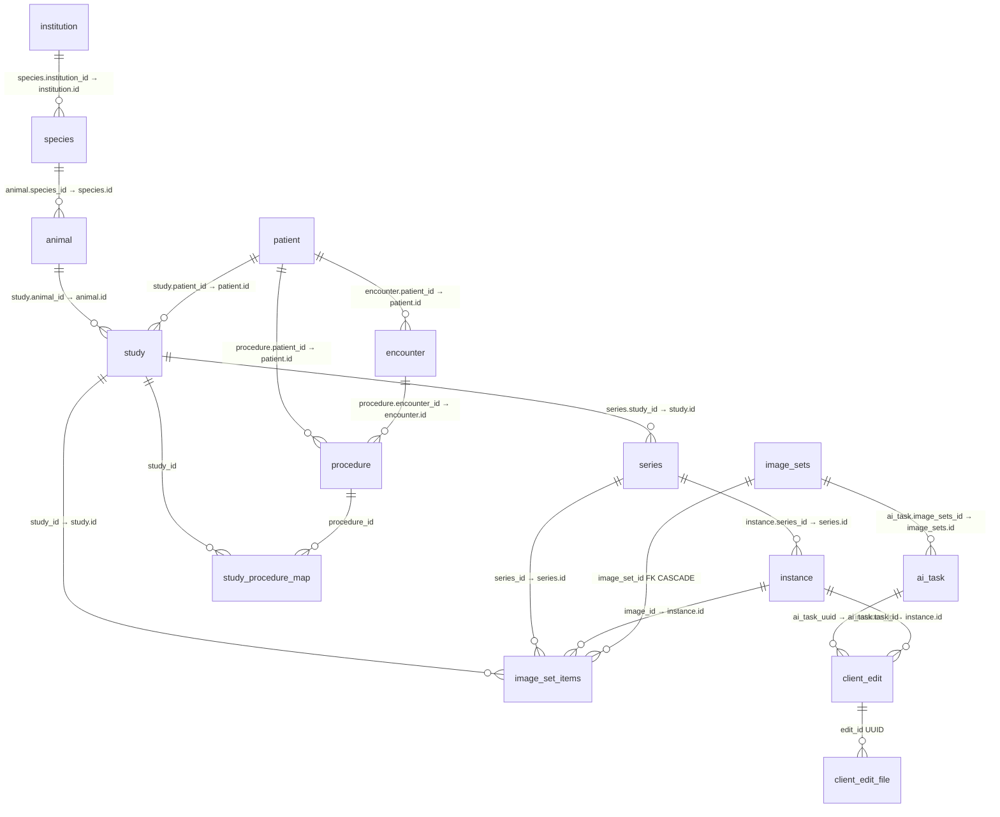

# Database Fields and Relations

Field catalog and join map for Omnisight business tables in PostgreSQL.

> **Authoritative DDL**: [`database/business_schema.sql`](../database/business_schema.sql)  
> **Go models**: `app/business/models/mod_*.go`  
> **Related docs**: [后台数据库模型说明](./后台数据库模型说明.md), [animal-storage-design](./animal-storage-design.md), [client-edit-result-storage-design](./client-edit-result-storage-design.md), [remote-ai-gateway-design](./remote-ai-gateway-design.md)  
> **Snapshot**: aligned with schema as of 2026-08 (includes animal + client_edit)

---

## 1. Naming pitfalls (read first)

Several columns share similar names but mean different things:

| Column | Table | Meaning | Points to |
|--------|-------|---------|-----------|
| `patient.id` | `patient` | Surrogate PK (bigint) | — |
| `patient.patient_id` | `patient` | Business PID string (e.g. hospital ID) | — |
| `study.patient_id` | `study` | **FK-like** to patient | **`patient.id`** (not `patient.patient_id`) |
| `animal.id` | `animal` | Surrogate PK | — |
| `animal.animal_id` | `animal` | Business animal number string | — |
| `study.animal_id` | `study` | **FK-like** to animal | **`animal.id`** (not `animal.animal_id`) |
| `encounter.id` | `encounter` | Surrogate PK | — |
| `encounter.encounter_id` | `encounter` | Business visit number string | — |
| `procedure.encounter_id` | `procedure` | **FK-like** to encounter | **`encounter.id`** |
| `image_set_items.image_id` | `image_set_items` | **FK-like** to instance | **`instance.id`** |
| `ai_task.id` | `ai_task` | Surrogate PK | — |
| `ai_task.task_id` | `ai_task` | Public task UUID | — |
| `ai_task.image_sets_id` | `ai_task` | **FK-like** to image set | **`image_sets.id`** |
| `client_edit.id` | `client_edit` | Surrogate PK | — |
| `client_edit.edit_id` | `client_edit` | Public edit UUID (+ MinIO prefix) | — |
| `client_edit.ai_task_uuid` | `client_edit` | **FK-like** to AI task | **`ai_task.task_id`** (UUID, not `ai_task.id`) |
| `client_edit_file.edit_id` | `client_edit_file` | **FK-like** to edit | **`client_edit.edit_id`** (UUID, not `client_edit.id`) |

**Rule of thumb**: columns named `*_id` that are `bigint` usually reference another table’s surrogate `id`. Columns that are `varchar` / `uuid` with the same business noun are often the *business* key on the same row (e.g. `patient.patient_id`).

---

## 2. Entity relationship overview



### 2.1 Relation matrix

| From (child) | Column | To (parent) | Column | DB FK? | Notes |
|--------------|--------|-------------|--------|--------|-------|
| `study` | `patient_id` | `patient` | `id` | No | Human subject; XOR with `animal_id` |
| `study` | `animal_id` | `animal` | `id` | No | Animal subject; XOR with `patient_id` |
| `series` | `study_id` | `study` | `id` | No | PACS chain |
| `instance` | `series_id` | `series` | `id` | No | PACS chain |
| `species` | `institution_id` | `institution` | `id` | No | Optional |
| `animal` | `species_id` | `species` | `id` | No | Required on animal |
| `encounter` | `patient_id` | `patient` | `id` | No | Clinical |
| `procedure` | `encounter_id` | `encounter` | `id` | No | Clinical |
| `procedure` | `patient_id` | `patient` | `id` | No | Denormalized for query |
| `study_procedure_map` | `procedure_id` | `procedure` | `id` | No | M:N bridge |
| `study_procedure_map` | `study_id` | `study` | `id` | No | M:N bridge |
| `image_set_items` | `image_set_id` | `image_sets` | `id` | **Yes** | `ON DELETE CASCADE` |
| `image_set_items` | `image_id` | `instance` | `id` | No | XOR with `series_id` |
| `image_set_items` | `series_id` | `series` | `id` | No | XOR with `image_id` |
| `image_set_items` | `study_id` | `study` | `id` | No | Optional denormalized |
| `ai_task` | `image_sets_id` | `image_sets` | `id` | No | Inference/train input |
| `client_edit` | `instance_id` | `instance` | `id` | No | Source XOR branch A |
| `client_edit` | `ai_task_uuid` | `ai_task` | `task_id` | No | Source XOR branch B (UUID) |
| `client_edit_file` | `edit_id` | `client_edit` | `edit_id` | No | UUID join, versioned files |
| `resource_dept` | `resource_uuid` | PACS `pacs_uuid` | — | No | Soft link by type+uuid |
| `resource_dept` | `dept_id` | `sys_dept` | `dept_id` | No | Admin org |

**Design convention**: PACS / clinical / AI / client_edit chains mostly use **logical references** (indexes + app checks), not PostgreSQL `FOREIGN KEY`, except `image_set_items.image_set_id`.

**Soft delete**: most business tables use `deleted_at`; active-row uniqueness uses partial unique indexes (`WHERE deleted_at IS NULL`).

---

## 3. Go model ↔ table map

| Table | Go type | File |
|-------|---------|------|
| `patient` | `Patient` | `mod_patient.go` |
| `study` | `Study` | `mod_study.go` |
| `series` | `Series` | `mod_series.go` |
| `instance` | `Instance` | `mod_instance.go` |
| `institution` | `Institution` | `mod_institution.go` |
| `species` | `Species` | `mod_species.go` |
| `animal` | `Animal` | `mod_animal.go` |
| `encounter` | `Encounter` | `mod_encouter.go` |
| `procedure` | `Procedure` | `mod_procedure.go` |
| `study_procedure_map` | `StudyProcedureMap` | `mod_study_procedure.go` |
| `image_sets` | `AIImageSet` | `mod_ai_image_set.go` |
| `image_set_items` | `AIImageSetItem` | `mod_ai_image_set.go` |
| `ai_task` | `AITask` | `mod_ai.go` |
| `ai_procedure` | `AiProcedure` | `mod_ai.go` (legacy; not in `business_schema.sql`) |
| `client_edit` | `ClientEdit` | `mod_client_edit.go` |
| `client_edit_file` | `ClientEditFile` | `mod_client_edit.go` |

---

## 4. PACS / DICOM domain

### 4.1 `patient`

| Column | Type | Null | Description |
|--------|------|------|-------------|
| `id` | bigint PK | NO | Surrogate key; referenced by `study.patient_id`, `encounter.patient_id`, `procedure.patient_id` |
| `pacs_uuid` | uuid UNIQUE | NO | System UUID (`gen_random_uuid`) |
| `patient_id` | varchar(64) UNIQUE | NO | **Business** patient ID string |
| `patient_id_org` | varchar(64) | YES | Org-scoped patient ID |
| `patient_name` | varchar(128) | YES | Display name |
| `patient_name_raw` | text | YES | Raw import name (SQL); may be absent in Go model |
| `patient_sex` | char(1) | YES | `M` / `F` / `O` |
| `patient_birth_date` | date | YES | Birth date |
| `patient_birth_time` | time | YES | Birth time (DICOM) |
| `patient_age` | integer | YES | Age |
| `version` | integer | NO | Optimistic lock, default 1 |
| `meta` | jsonb | YES | Extension JSON |
| `remark` | text | YES | Free-text remark (trigram index) |
| `created_at` / `updated_at` | timestamptz | NO | Audit |
| `deleted_at` | timestamptz | YES | Soft delete |

### 4.2 `study`

| Column | Type | Null | Description |
|--------|------|------|-------------|
| `id` | bigint PK | NO | Surrogate key; referenced by `series.study_id`, maps, image_set_items |
| `pacs_uuid` | uuid UNIQUE | NO | System UUID |
| `patient_id` | bigint | YES* | → **`patient.id`**. Human subject. |
| `animal_id` | bigint | YES* | → **`animal.id`**. Animal subject. |
| `study_instance_uid` | varchar(64) | NO | DICOM Study Instance UID |
| `study_date` / `study_time` | date / time | YES | Study datetime |
| `study_description` | text | YES | Description |
| `accession_number` | varchar(64) | YES | Accession |
| `referring_physician_name` | text | YES | Referring physician |
| `study_id` | varchar(32) | YES | DICOM Study ID (not PK) |
| `version` | integer | NO | Optimistic lock |
| `created_at` / `updated_at` / `deleted_at` | timestamptz | — | Audit / soft delete |

\* Constraint `study_subject_check`: exactly one of (`patient_id`, `animal_id`) is non-null.

```text
Human:  study.patient_id = patient.id , study.animal_id IS NULL
Animal: study.animal_id  = animal.id  , study.patient_id IS NULL
```

### 4.3 `series`

| Column | Type | Null | Description |
|--------|------|------|-------------|
| `id` | bigint PK | NO | Surrogate key; referenced by `instance.series_id`, image_set_items |
| `pacs_uuid` | uuid UNIQUE | NO | System UUID |
| `study_id` | bigint | NO | → **`study.id`** |
| `series_instance_uid` | varchar(64) UNIQUE | NO | DICOM Series Instance UID |
| `modality` | varchar(16) | YES | e.g. CT / MR / US / OCT |
| `series_number` | integer | YES | Series number |
| `series_description` | text | YES | Description |
| `body_part_examined` | varchar(32) | YES | Body part |
| `version` / audit / `deleted_at` | — | — | Same pattern as study |

### 4.4 `instance`

| Column | Type | Null | Description |
|--------|------|------|-------------|
| `id` | bigint PK | NO | Surrogate key; aka “image id” in AI paths (`image_set_items.image_id`, `client_edit.instance_id`) |
| `pacs_uuid` | uuid UNIQUE | NO | System UUID |
| `series_id` | bigint | NO | → **`series.id`** |
| `sop_instance_uid` | varchar(64) | NO | DICOM SOP Instance UID (active unique) |
| `sop_class_uid` | varchar(64) | YES | SOP Class |
| `instance_number` | integer | YES | Instance number |
| `file_path` | text | NO | Object store key / path (`bucket:key` style in app) |
| `file_size` | bigint | YES | Bytes |
| `transfer_syntax_uid` | varchar(64) | YES | Transfer syntax |
| `meta_tag` | jsonb | NO | Tags / labels (GIN indexed) |
| `version` / audit / `deleted_at` | — | — | Soft delete |

**PACS join path**:

```sql
SELECT i.*
FROM instance i
JOIN series  s  ON s.id = i.series_id  AND s.deleted_at IS NULL
JOIN study   st ON st.id = s.study_id  AND st.deleted_at IS NULL
LEFT JOIN patient p ON p.id = st.patient_id AND p.deleted_at IS NULL
LEFT JOIN animal  a ON a.id = st.animal_id  AND a.deleted_at IS NULL
WHERE i.deleted_at IS NULL;
```

---

## 5. Animal domain

### 5.1 `institution`

| Column | Type | Null | Description |
|--------|------|------|-------------|
| `id` | bigint PK | NO | Surrogate key; referenced by `species.institution_id` |
| `name` | text | NO | Institution name (active unique) |
| `address` / `contact_info` / `description` | text | YES | Profile |
| `creation_time` | bigint | YES | Device-side epoch ms |
| `meta` | jsonb | YES | Server extension |
| audit / `deleted_at` | timestamptz | — | Soft delete |

### 5.2 `species`

| Column | Type | Null | Description |
|--------|------|------|-------------|
| `id` | bigint PK | NO | Surrogate key; referenced by `animal.species_id` |
| `institution_id` | bigint | YES | → **`institution.id`** (logical) |
| `ri_cornea` / `ri_lens` / `ri_retina` | float8 | YES | Optical constants |
| `scale_k` / `scale_c` | float8 | YES | Scale params |
| `effective_focal_length` / `std_axial_length` | float8 | YES | Optics |
| `name` | text | NO | Species name (active unique) |
| `description` / `notes` | text | YES | Text |
| `creation_time` | bigint | YES | Device epoch ms |
| `editable` | integer | NO | Default 0 |
| `meta` / audit / `deleted_at` | — | — | Soft delete |

### 5.3 `animal`

| Column | Type | Null | Description |
|--------|------|------|-------------|
| `id` | bigint PK | NO | Surrogate key; referenced by **`study.animal_id`** |
| `pacs_uuid` | uuid UNIQUE | NO | System UUID |
| `animal_id` | varchar(64) UNIQUE | NO | **Business** animal number string |
| `animal_id_org` | varchar(64) | YES | Org / ear-tag style ID |
| `animal_name` / `animal_name_raw` | varchar / text | YES | Name |
| `animal_sex` | char(1) | YES | `M` / `F` / `O` |
| `animal_birth_date` / `animal_birth_time` | date / time | YES | Birth |
| `animal_age` | integer | YES | Age |
| `species_id` | bigint | NO | → **`species.id`** |
| `meta` / `remark` / `version` / audit / `deleted_at` | — | — | Same pattern as patient |

---

## 6. Clinical domain

### 6.1 `encounter`

| Column | Type | Null | Description |
|--------|------|------|-------------|
| `id` | bigint PK | NO | Surrogate key; referenced by `procedure.encounter_id` |
| `encounter_id` | varchar(64) UNIQUE | NO | Business visit number (e.g. `OP202506150001`) |
| `patient_id` | bigint | NO | → **`patient.id`** |
| `encounter_type` | varchar(20) | NO | `OPD` / `IPD` / `ER` / `PH` |
| `department` / `doctor` | varchar | YES | Dept / physician |
| `status` | varchar(20) | YES | Default `IN_PROGRESS` |
| `admit_time` / `discharge_time` | timestamptz | — | Visit window |
| `diagnosis` / `diagnosis_code` | text / varchar | YES | Diagnosis |
| audit / `deleted_at` | — | — | Soft delete |

### 6.2 `encounter_seq_daily`

| Column | Type | Description |
|--------|------|-------------|
| `seq_date` | date PK | Calendar day |
| `seq_value` | integer | Daily counter for generating `encounter.encounter_id` |

No foreign keys; helper table for ID generation.

### 6.3 `procedure`

| Column | Type | Null | Description |
|--------|------|------|-------------|
| `id` | bigint PK | NO | Surrogate key; used in `study_procedure_map.procedure_id` |
| `encounter_id` | bigint | NO | → **`encounter.id`** |
| `patient_id` | bigint | NO | → **`patient.id`** (denormalized) |
| `procedure_code` / `procedure_name` | varchar | — | Code / name |
| `procedure_type` | varchar(20) | NO | `surgery` / `laser` / `injection` / `therapy` |
| `status` | varchar(20) | NO | Default `PLANNED` |
| `body_part` / `laterality` | text | YES | Laterality `L` / `R` / `B` |
| `start_time` / `end_time` | timestamptz | YES | Window |
| `performing_doctor` / `anesthesia_type` | varchar | YES | Staff / anesthesia |
| `outcome` / `notes` | text | YES | Result notes |
| `meta` | jsonb | YES | Extension |
| audit / `deleted_at` | — | — | Soft delete |

### 6.4 `study_procedure_map`

| Column | Type | Description |
|--------|------|-------------|
| `procedure_id` | bigint PK part | → **`procedure.id`** |
| `study_id` | bigint PK part | → **`study.id`** |
| `relation_type` | text | `PRIMARY` / `SECONDARY` / `PRE_OP` / `INTRA_OP` / `POST_OP` / `FOLLOW_UP` / `REFERENCE` / `EXTERNAL` |
| `created_at` | timestamp | Created time |

---

## 7. AI / image-set domain

### 7.1 `image_sets`

| Column | Type | Null | Description |
|--------|------|------|-------------|
| `id` | bigint PK | NO | Surrogate key; referenced by `image_set_items.image_set_id`, `ai_task.image_sets_id` |
| `pacs_uuid` | uuid | NO | Set UUID |
| `type` | text | NO | `single` / `series` / `multi_series` / `custom` |
| `modality` | text | YES | Dominant modality |
| `snapshot_type` | text | NO | `by_image` / `by_series` |
| `frozen` | boolean | NO | Default true (immutable membership) |
| `hash` | text | YES | Content hash (active unique when set) |
| `meta` | jsonb | YES | Extension |
| `created_at` / `updated_at` | timestamptz | NO | Audit (no soft delete) |

### 7.2 `image_set_items`

| Column | Type | Null | Description |
|--------|------|------|-------------|
| `id` | bigint PK | NO | Item PK |
| `image_set_id` | bigint | NO | → **`image_sets.id`** (**DB FK**, CASCADE) |
| `image_id` | bigint | YES* | → **`instance.id`** |
| `series_id` | bigint | YES* | → **`series.id`** |
| `sort_index` | integer | NO | Order within set |
| `snapshot_path` | text | YES | Snapshot object path |
| `study_id` | bigint | YES | → **`study.id`** (denormalized) |
| `modality` | text | YES | Item modality |
| `meta` | jsonb | YES | Extension |
| `created_at` | timestamptz | NO | Created |

\* Check `chk_image_set_items_one_ref`: exactly one of `image_id` / `series_id`.

### 7.3 `ai_task`

| Column | Type | Null | Description |
|--------|------|------|-------------|
| `id` | bigint PK | NO | Internal PK |
| `task_id` | uuid UNIQUE | NO | Public task id; referenced by **`client_edit.ai_task_uuid`** |
| `task_name` | text | NO | Display / route name |
| `image_sets_id` | bigint | YES | → **`image_sets.id`** |
| `pacs_uuid` | uuid | YES | Optional link |
| `task_type` | text | NO | e.g. `inference` / `train` |
| `model_name` / `model_version` | text | NO | Model identity |
| `status` | text | NO | Gateway: `running` / `failed` / `completed` / `deprecated` |
| `input_summary` / `output_summary` | text | YES | JSON text summaries |
| `result_path` / `log_path` | text | YES | Result / log paths |
| `error_message` | text | YES | Failure detail |
| `priority` / `retry_count` / `max_retries` | integer | — | Scheduling |
| `scheduled_at` / `started_at` / `finished_at` | timestamptz | YES | Lifecycle |
| `worker_id` / `hostname` | text | YES | Executor |
| `idempotency_key` | text | YES | With `user_id` unique |
| `user_id` | bigint | YES | → admin user (logical) |
| `duration_ms` | integer | YES | Duration in **milliseconds** |
| `created_at` / `updated_at` | timestamptz | YES | Audit |

---

## 8. Client edit domain

### 8.1 `client_edit`

| Column | Type | Null | Description |
|--------|------|------|-------------|
| `id` | bigint PK | NO | Internal PK |
| `edit_id` | uuid UNIQUE | NO | Public id; MinIO prefix; referenced by **`client_edit_file.edit_id`** |
| `instance_id` | bigint | YES* | → **`instance.id`** (raw-image source) |
| `ai_task_uuid` | uuid | YES* | → **`ai_task.task_id`** (AI output source) |
| `source_object_key` | text | YES* | Required with AI source: object key under AI task bucket |
| `name` | text | NO | Scheme title |
| `tool_kind` | text | NO | `manual` / `frontend_ai` / `import` / `other` |
| `tool_name` / `tool_version` | text | — | Concrete tool |
| `kind` | text | NO | `mask` / `point_map` / `overlay` / `json` / `rtplan` / `bundle` / `other` |
| `status` | text | NO | `active` / `deprecated` |
| `current_revision` | integer | NO | Latest revision number |
| `note` | text | YES | Note |
| `meta` | jsonb | NO | Extension |
| `user_id` | bigint | YES | Editor (logical → `sys_user`) |
| audit / `deleted_at` | — | — | Soft delete |

\* `client_edit_source_xor_chk`: either (`instance_id` only) or (`ai_task_uuid` + `source_object_key`).

### 8.2 `client_edit_file`

| Column | Type | Null | Description |
|--------|------|------|-------------|
| `id` | bigint PK | NO | File row PK |
| `edit_id` | uuid | NO | → **`client_edit.edit_id`** |
| `revision` | integer | NO | Version number |
| `file_name` | text | NO | Logical file name |
| `object_key` | text | NO | MinIO key (unique when active) |
| `content_type` | text | YES | MIME |
| `file_size` | bigint | YES | Bytes |
| `checksum_sha256` | text | YES | Checksum |
| `role` | text | NO | `primary` / `sidecar` / `preview` |
| `meta` | jsonb | NO | Extension |
| `created_at` / `deleted_at` | timestamptz | — | Soft delete |

Unique active: `(edit_id, revision, file_name)`.

---

## 9. Permission / admin (brief)

### 9.1 `resource_dept`

| Column | Description |
|--------|-------------|
| `id` | PK |
| `resource_type` | Resource kind string |
| `resource_uuid` | Usually a PACS `pacs_uuid` text |
| `dept_id` | → `sys_dept.dept_id` (logical) |

### 9.2 Admin tables (`sys_*`)

Created by go-admin migrations / `config/db.sql`. Not redefined here. Typical links:

- `sys_role_menu` → `sys_role`, `sys_menu`
- `sys_menu_api_rule` → `sys_menu`, `sys_api`
- `casbin_rule` — Casbin adapter table (runtime)

---

## 10. Quick join recipes

### 10.1 Instance → patient / animal

```sql
-- Human
SELECT p.patient_id AS business_pid, p.patient_name, i.id AS instance_id
FROM instance i
JOIN series s ON s.id = i.series_id
JOIN study  st ON st.id = s.study_id
JOIN patient p ON p.id = st.patient_id
WHERE i.id = $1;

-- Animal
SELECT a.animal_id AS business_aid, a.animal_name, sp.name AS species, i.id AS instance_id
FROM instance i
JOIN series s ON s.id = i.series_id
JOIN study  st ON st.id = s.study_id
JOIN animal a ON a.id = st.animal_id
JOIN species sp ON sp.id = a.species_id
WHERE i.id = $1;
```

### 10.2 AI task → instances

```sql
SELECT t.task_id, isi.image_id AS instance_id, isi.sort_index
FROM ai_task t
JOIN image_set_items isi ON isi.image_set_id = t.image_sets_id
WHERE t.task_id = $1::uuid
ORDER BY isi.sort_index;
```

### 10.3 Client edit → source

```sql
-- From raw instance
SELECT e.edit_id, e.current_revision, e.tool_name
FROM client_edit e
WHERE e.instance_id = $1 AND e.deleted_at IS NULL;

-- From AI task UUID
SELECT e.edit_id, e.source_object_key, f.revision, f.file_name, f.object_key
FROM client_edit e
JOIN client_edit_file f ON f.edit_id = e.edit_id AND f.deleted_at IS NULL
WHERE e.ai_task_uuid = $1::uuid AND e.deleted_at IS NULL;
```

---

## 11. Sources of truth

| Topic | Source |
|-------|--------|
| Column types / checks / indexes | `database/business_schema.sql` |
| Animal XOR study subject | `docs/animal-storage-design.md`, `Study.ValidateSubject()` |
| Client edit source XOR + files | `docs/client-edit-result-storage-design.md` |
| Image set / AI gateway | `docs/remote-ai-gateway-design.md` |
| Broader DDL commentary | `docs/后台数据库模型说明.md` |

When SQL and Go model diverge (e.g. optional columns not mapped in GORM), **prefer the SQL schema** for storage truth and the Go model for what the current API layer reads/writes.
