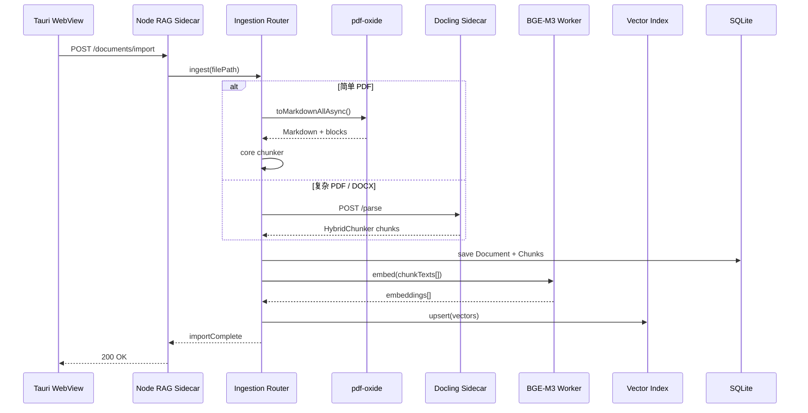
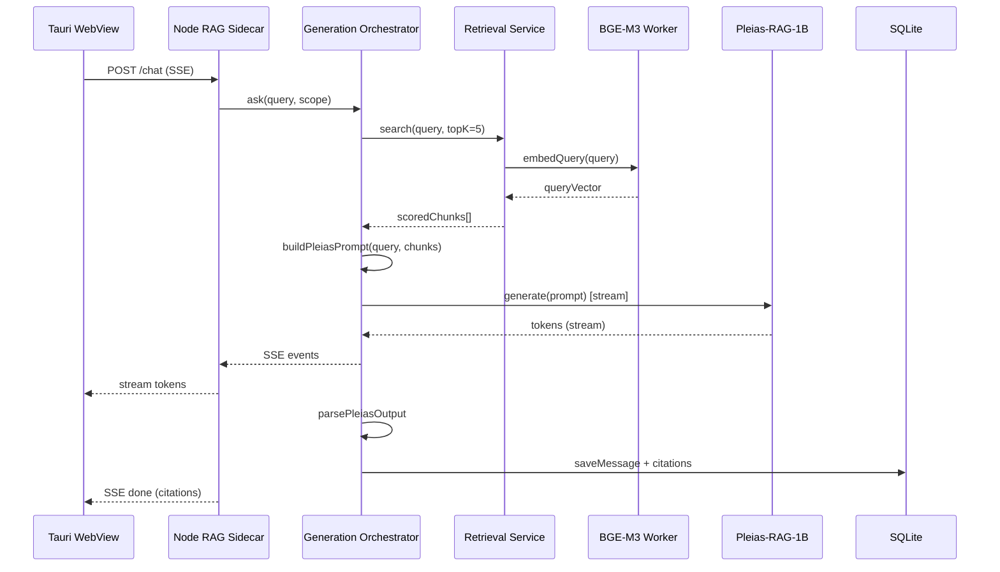

# piFlow RAG Application Architecture

> Cross-platform local RAG application based on **Pleias-RAG-1B** and **BGE-M3**  
> Stack: TypeScript / JavaScript · **Tauri 2** · **Windows-first** (portable package)

> **Language**: English. Chinese original: [architecture.md](architecture.md).

---

## 1. Project Overview

### 1.1 Goals

Build a **fully local** retrieval-augmented generation (RAG) desktop application that meets these core needs:

| Need | Description |
|------|-------------|
| Traceable answers | Generated content includes source citations and literal quotes to reduce hallucination risk |
| Privacy-first | Documents, vectors, and inference all run locally; no cloud upload required |
| Lightweight deployment | 1B-class generation model + efficient embedding model, runnable on consumer hardware |
| Cross-platform evolution | **Windows is the first release platform**; architecture keeps room for other desktop platforms (unverified) |

### 1.2 Model Selection

#### Pleias-RAG-1B (Generation / Inference Layer)

- **Parameters**: ~1.2B; a small reasoning model aimed at RAG, search, and source summarization
- **Core capabilities**:
  - Structured input/output (special tokens delimit query, sources, reasoning, answer)
  - Built-in citation generation: produces citations with literal quotes during reasoning, not post-hoc attribution
  - Proto-agentic abilities: query understanding, language detection, query rewriting, source re-ranking, refusal decisions
  - Multilingual support; answer language follows the user's query language
- **Deployment forms**:
  - Official [Pleias-RAG-Library](https://github.com/Pleias/Pleias-RAG-Library) (Python, vLLM / Transformers)
  - [GGUF version](https://huggingface.co/PleIAs/Pleias-RAG-1B-gguf) (~2.4 GB, CPU-friendly, suitable for Node bindings)

#### BGE-M3 (Embedding / Retrieval Layer)

- **Source**: [BAAI/bge-m3](https://huggingface.co/BAAI/bge-m3)
- **Core capabilities**:
  - Multilingual (100+ languages) dense vector retrieval
  - Sparse retrieval (lexical matching) and multi-vector interaction (ColBERT-style) — optional hybrid retrieval
  - Output dimension: 1024 (dense)
- **JS runtime**: [Xenova/bge-m3](https://huggingface.co/Xenova/bge-m3) + `@huggingface/transformers` (ONNX, supports fp16 / q4 quantization)

### 1.3 Non-Goals (v1)

- Cloud inference or multi-tenant SaaS
- Real-time collaborative knowledge-base editing
- Large-scale distributed retrieval replacing a professional vector database (v1 targets single-user local use)

---

## 2. System Architecture Overview

Uses a **Tauri 2 + Node Sidecar** dual-process architecture: Tauri provides a lightweight UI shell and system integration; the Node process hosts retrieval, ingestion, and the Agent. **The primary chat entry is piFlow (Pi Agent)**; the knowledge base is mounted via Skill/Tools (`kb_*`). The Knowledge page is only for import and document management.

```
+------------------------------------------------------------------+
|              Tauri WebView (React + TypeScript)                  |
|  Knowledge | piFlow (主对话) | Citations UI | Settings           |
+-----+------------------+-------------------+---------------------+
      |                  | HTTP/SSE localhost                      |
+-----v------------------v-----------------------------------------+
|              Node Sidecar (apps/rag-server :3847)                |
|  Ingestion | Retrieval (kb tools) | piFlow Agent + Skills        |
|  BGE-M3 + SQLite vectors | pg-actions | knowledge-rag | local-fs |
+-------------------------------+----------------------------------+
                                ^
                                | spawn / paths / dialogs
+-------------------------------v----------------------------------+
|  Tauri Rust Shell (sidecar lifecycle, window, capabilities)      |
+------------------------------------------------------------------+
```

**piFlow-specific design** (Agent-first, knowledge-rag B1, citations, Skill model, **soft source constraints / no Host Grounding Gate**) is in **[piflow.md](piflow.md)** (Chinese) §3.4.

### 2.1 Architecture Principles

1. **Tauri is shell-only**: Rust code is limited to window, Sidecar lifecycle, and system APIs; all business logic is in TypeScript
2. **Node Sidecar hosts inference**: Native modules such as `node-llama-cpp` and `better-sqlite3` run in a separate Node process, not in the WebView
3. **Interfaces first**: `packages/core` defines RAG interfaces; the Sidecar exposes an HTTP API reusable by frontend and tests
4. **piFlow as primary + RAG as plugins**: Main Q&A goes through `/piflow/*` + Pi Skills; knowledge-base retrieval is exposed as `kb_*` tools (see [piflow.md](piflow.md) (Chinese) v0.3)
5. **Progressive complexity**: v1 uses dense retrieval + Pleias structured prompts; hybrid retrieval is a v2 enhancement
6. **Platform abstraction**: Paths, model directories, and hardware probing are wrapped in `PlatformAdapter`, implemented by the Sidecar with environment variables injected by Tauri

---

## 3. Technology Stack

### 3.1 Chosen Stack

| Layer | Technology | Rationale |
|------|------------|-----------|
| Desktop shell | **Tauri 2** | Small footprint (~5–10 MB), system WebView, mature packaging/signing toolchain, cross-platform |
| Frontend framework | **React + TypeScript** | Rich component ecosystem; aligns with official Tauri templates |
| Build tool | **Vite** | Officially recommended by Tauri; good HMR experience |
| RAG backend | **Node Sidecar** (`apps/rag-server`) | Full Node native-module support; isolated from the UI process |
| Frontend ↔ backend | **HTTP + SSE** (localhost) | Simple, independently debuggable; streaming answers via Server-Sent Events |
| Tauri ↔ Sidecar | **Tauri Sidecar API** | Rust side starts/monitors the Node binary and cleans up on app exit |
| Embedding model | **@huggingface/transformers** + Xenova/bge-m3 | Pure JS/ONNX; same path for Windows development and portable packages |
| Generation model | **node-llama-cpp** + Pleias-RAG-1B GGUF | Native Node bindings; no Python dependency |
| Vector retrieval | **hnswlib-node** or **usearch** | Local ANN; installable via npm |
| Metadata storage | **better-sqlite3** | Runs inside the Sidecar process |
| PDF parsing | **pdf-oxide** | Rust core + Node N-API; fast Markdown/table extraction in the Node Sidecar |
| Complex document parsing | **Docling** (Python Sidecar) | Multi-format, layout understanding, OCR, built-in HybridChunker |
| DOCX parsing | **mammoth** (Phase 1) → Docling (Phase 2) | Lightweight MVP; complex Word via Docling |
| Chunking | **packages/core** + Docling HybridChunker | Structure-aware chunking aligned to the BGE-M3 token window |

### 3.2 Tauri + Node Sidecar Responsibilities

| Responsibility | Tauri (Rust + WebView) | Node Sidecar |
|------|-------------------------|--------------|
| UI rendering | ✅ React | — |
| File picker dialogs | ✅ `@tauri-apps/plugin-dialog` | — |
| App menu / tray | ✅ Tauri API | — |
| Start / stop RAG service | ✅ Sidecar spawn | — |
| Document parsing / chunking | — | ✅ pdf-oxide + core chunker |
| Complex document parsing | — | ✅ Docling Sidecar (Phase 2) |
| Embedding / retrieval / generation | — | ✅ |
| SQLite / vector index | — | ✅ |
| Model download & cache | Show progress (UI) | ✅ Actual download |

**Expected Rust surface area**: With the `create-tauri-app` template + Sidecar config, day-to-day development is almost entirely TypeScript.

### 3.3 Sidecar Lifecycle

```
应用启动
  → Tauri Rust: spawn_sidecar("rag-server")
  → Node: 加载模型、监听 127.0.0.1:{port}
  → WebView: fetch("/health") 等待就绪
  → 用户操作...

应用退出
  → Tauri: kill sidecar
  → Node: 释放模型、关闭 DB 连接
```

In the Windows portable build, the Sidecar ships as a **zip + embedded Node runtime** (extracted on first launch to `%APPDATA%\piFlow\sidecar\`), without relying on multi-platform-named externalBin:

```
%APPDATA%\piFlow\sidecar\rag-server\
├── dist\
├── node_modules\
└── …
```

In development, run `pnpm --filter @bluelamp/rag-server dev` directly; no need to rebuild the portable package each time.

### 3.4 Fallback (Generation Layer)

If `node-llama-cpp` support for Pleias special-token templates is incomplete, the generation backend can be replaced by a **Python Sidecar** (also mounted via the Tauri Sidecar mechanism):

```
┌──────────────┐   HTTP/SSE    ┌──────────────────┐   内部调用   ┌─────────────────┐
│ Tauri WebView│ ◄───────────► │ Node RAG Sidecar │ ◄──────────► │ Python Sidecar  │
│  (React UI)  │               │ 检索 + 编排       │              │ Pleias-RAG-Lib  │
└──────────────┘               └──────────────────┘              └─────────────────┘
```

v1 prefers the pure Node path; Python is the fallback.

### 3.5 Document Parsing & Chunking (Layered Strategy)

Uses **layered routing**: choose parsers by document complexity rather than one library for all formats:

```
┌─────────────────────────────────────────────────────────────────┐
│                    Ingestion Router（Node Sidecar）               │
├─────────────────────────────────────────────────────────────────┤
│  txt / md / html     →  直接读取 + packages/core chunker        │
│  简单 PDF            →  pdf-oxide → Markdown → core chunker     │
│  复杂 PDF / DOCX /   →  Docling Sidecar → HybridChunker         │
│  扫描件 / 多栏 / 表格 │     （HTTP 子进程调用）                    │
└─────────────────────────────────────────────────────────────────┘
```

#### Library Comparison

| | **pdf-oxide** | **Docling** |
|--|---------------|-------------|
| Runtime | Node Sidecar (`npm i pdf-oxide`) | Python Sidecar (`pip install docling`) |
| Formats | Primarily **PDF** | PDF, DOCX, PPTX, XLSX, HTML, image OCR, etc. |
| Capabilities | Text/Markdown extraction, table detection, async API | Layout understanding, reading order, OCR, formulas, built-in chunker |
| Chunk | **None** (outputs Markdown; core does chunking) | `HierarchicalChunker` / `HybridChunker` (with bbox, page numbers) |
| Performance | Very fast (~0.8 ms/page class) | Heavier; includes layout models; quality-first |
| License | MIT / Apache-2.0 | MIT |

#### Routing Rules (Heuristics)

| Condition | Route to |
|------|----------|
| `.txt` / `.md` / `.html` | Built-in text parser |
| `.pdf` with optional text layer, page count < 50 | pdf-oxide |
| `.pdf` scans / many tables / multi-column layout | Docling |
| `.docx` / `.pptx` / `.xlsx` | Docling |
| User selects “high-quality parsing” | Docling |

Phase 1 implements only pdf-oxide + text formats; the Docling Sidecar lands in Phase 2.

---

## 4. Core Module Design

### 4.1 Document Ingestion (Ingestion Service)

**Responsibility**: Turn user-imported files into searchable chunks and vectors.

```
原始文件 → 路由选择解析器 → 结构化文本 → 分块 → 嵌入 → 写入索引
```

#### 4.1.1 Parser Abstraction

All parsers output a unified `ParsedDocument` for the chunker:

```typescript
type ParserBackend = 'native' | 'pdf-oxide' | 'docling';

interface ParsedBlock {
  type: 'paragraph' | 'heading' | 'table' | 'list' | 'code';
  text: string;
  level?: number;       // heading level (1–6)
  page?: number;
  bbox?: [number, number, number, number]; // [x0, y0, x1, y1], provided by Docling
  confidence?: number;
}

interface ParsedDocument {
  title: string;
  mimeType: string;
  backend: ParserBackend;
  blocks: ParsedBlock[];
  markdown?: string;    // optional export from pdf-oxide / Docling
}

interface DocumentParser {
  canHandle(mimeType: string, hints?: ParseHints): boolean;
  parse(filePath: string, options?: ParseOptions): Promise<ParsedDocument>;
}

interface ParseHints {
  pageCount?: number;
  hasTextLayer?: boolean;
  forceHighQuality?: boolean;  // user forces Docling
}
```

#### 4.1.2 pdf-oxide (Node, Default PDF Path)

Called from the Node Sidecar for **PDF → Markdown/structured text**:

```typescript
import { PdfDocument } from 'pdf-oxide';

async function parseWithPdfOxide(filePath: string): Promise<ParsedDocument> {
  const doc = await PdfDocument.open(filePath);
  const markdown = await doc.toMarkdownAllAsync({ detectHeadings: true });
  // Parse Markdown into ParsedBlock[] (split on # headings and table boundaries)
  return { title: basename(filePath), mimeType: 'application/pdf', backend: 'pdf-oxide', blocks: markdownToBlocks(markdown), markdown };
}
```

**Key points**:

- Use `*Async` methods to avoid blocking the Node event loop
- Prebuilt N-API binaries; Windows x64 works out of the box
- No chunking; hand off to the `packages/core` chunker

#### 4.1.3 Docling (Python Sidecar, High-Quality Path)

Called over HTTP to a Python sub-service for **complex documents → already-chunked results**:

```python
# apps/docling-sidecar/main.py (illustrative)
from docling.document_converter import DocumentConverter
from docling.chunking import HybridChunker

converter = DocumentConverter()
chunker = HybridChunker(max_tokens=512, merge_peers=True)

doc = converter.convert(file_path).document
for chunk in chunker.chunk(doc):
    yield {
        "text": chunker.contextualize(chunk),
        "metadata": chunk.meta.export_dict(),  # page, bbox, headings
    }
```

The Node Sidecar calls `POST /parse` and receives JSON aligned with the `Chunk` model.

**Key points**:

- `HybridChunker` `max_tokens=512` aligns with the BGE-M3 embedding window
- Chunk metadata (`page`, `bbox`, heading hierarchy) feeds Pleias citation UI directly
- First run downloads layout/OCR models; disk and memory cost exceed pdf-oxide
- Tauri may mount it as a second Sidecar, or Node may `spawn` it as a child process

#### 4.1.4 Chunking Strategy

| Source | Strategy | Parameters |
|------|------|------|
| txt / md / html | Heading hierarchy + recursive character split | `max_tokens=512`, `overlap=10–15%` |
| pdf-oxide output | Split on Markdown `#` headings; **keep tables whole**, never split across chunks | Same as above |
| Docling output | Use `HybridChunker` results directly | `max_tokens=512`, `merge_peers=True` |

After chunking, enrich metadata and write the `Chunk` model:

```typescript
interface Chunk {
  id: string;
  documentId: string;
  content: string;
  metadata: {
    page?: number;
    heading?: string;       // heading breadcrumb, e.g. "Chapter 1 > Section 2"
    charOffset: number;
    bbox?: [number, number, number, number];
    parserBackend: ParserBackend;
    blockType?: ParsedBlock['type'];
  };
  embedding?: Float32Array; // 1024-dim for BGE-M3 dense
}
```

#### 4.1.5 Data Model (Document)

```typescript
interface Document {
  id: string;
  title: string;
  sourcePath: string;
  mimeType: string;
  parserBackend: ParserBackend;
  pageCount?: number;
  createdAt: Date;
  updatedAt: Date;
}
```

> `Chunk` is defined in §4.1.4 and is not repeated here.

#### 4.1.6 Ingestion Router Flow

```typescript
// packages/core/ingestion/router.ts
async function ingest(filePath: string, hints?: ParseHints): Promise<Chunk[]> {
  const route = selectParser(filePath, hints);
  const parsed = await parsers[route].parse(filePath);
  const chunks = route === 'docling'
    ? parsed.blocks.map(toChunk)           // Docling already chunked
    : chunker.split(parsed.blocks);        // pdf-oxide / native use core chunker
  const embeddings = await embedder.embed(chunks.map(c => c.content));
  await vectorIndex.upsert(chunks, embeddings);
  return chunks;
}
```

### 4.2 Embedding Service

**Responsibility**: Load BGE-M3 and provide batch/single-text vectorization.

```typescript
interface Embedder {
  initialize(options?: EmbedderOptions): Promise<void>;
  embed(texts: string[]): Promise<Float32Array[]>;
  embedQuery(query: string): Promise<Float32Array>;
  dispose(): Promise<void>;
}

interface EmbedderOptions {
  modelId: 'Xenova/bge-m3';
  dtype: 'fp32' | 'fp16' | 'q4';  // Windows default: fp16
  device: 'wasm' | 'webgpu';       // Node default: wasm
  maxBatchSize: number;
}
```

**Implementation notes**:

- Load the model in a **Worker Thread** (`worker_threads`) to avoid blocking the UI
- Local-first: load ONNX from `models/Xenova/bge-m3/` (see §4.7); on validation failure, auto-redownload from the mirror
- Query and Document use the same `pooling: 'cls', normalize: true` config (matches official examples)
- BGE-M3 officially recommends an instruction prefix on queries (retrieval):  
  `"Represent this sentence for searching relevant passages: "` + query

### 4.3 Retrieval Service

**Responsibility**: Return Top-K relevant chunks for a user query.

#### 4.3.1 v1: Dense Retrieval

```
query → embedQuery → ANN search (cosine) → Top-K chunks → 可选 rerank
```

```typescript
interface Retriever {
  index(chunks: Chunk[]): Promise<void>;
  search(query: string, topK: number): Promise<ScoredChunk[]>;
  removeByDocumentId(documentId: string): Promise<void>;
}

interface ScoredChunk {
  chunk: Chunk;
  score: number;
}
```

#### 4.3.2 Enhanced: Hybrid Retrieval (v2)

BGE-M3 also supports sparse (lexical) and multi-vector retrieval. Transformers.js currently focuses on dense; for full hybrid, consider:

- Local BM25 (`wink-bm25`) + dense score fusion (RRF)
- Or a Python microservice running the full BGE-M3 inference pipeline

### 4.4 Generation Orchestrator

**Responsibility**: Assemble query + retrieved sources into Pleias structured input, call the generation model, and parse structured output.

#### 4.4.1 Pleias Input Format

Pleias-RAG models require structured query and sources. Per the official format:

```
<|query_start|>{user_query}<|query_end|>
<|source_start|>{source_id_1}<|source_sep|>{source_text_1}<|source_end|>
<|source_start|>{source_id_2}<|source_sep|>{source_text_2}<|source_end|>
...
```

The application layer maps retrieved chunks to source entries with `source_id`, preserving traceable metadata.

#### 4.4.2 Pleias Output Parsing

Model output includes a reasoning trace and final answer; parse special tokens:

```
{reasoning_trace}
<|source_analysis_start|>{source_analysis}<|source_analysis_end|>
<|answer_start|>{answer_with_citations}<|answer_end|>
```

```typescript
interface PleiasResponse {
  reasoning?: string;
  sourceAnalysis: string;
  answer: string;
  citations: Citation[];
}

interface Citation {
  sourceId: string;
  quote: string;
  documentId: string;
  chunkId: string;
}
```

#### 4.4.3 Generation Backend Abstraction

```typescript
interface Generator {
  initialize(modelPath: string): Promise<void>;
  generate(prompt: string, options?: GenerateOptions): AsyncIterable<string>;
  dispose(): Promise<void>;
}
```

**node-llama-cpp implementation notes**:

- Load `Pleias-RAG-1B.gguf` (~2.4 GB unquantized)
- Configure a suitable `contextSize` (recommend ≥ 8192; adjust by retrieved source count)
- Use streaming (`onToken`) for typewriter effect
- Windows: evaluate CUDA when NVIDIA is available; otherwise CPU (path validated on this machine)

### 4.5 Session & State Management

```typescript
interface ChatSession {
  id: string;
  messages: Message[];
  attachedDocumentIds: string[];
  createdAt: Date;
}

interface Message {
  id: string;
  role: 'user' | 'assistant';
  content: string;
  citations?: Citation[];
  retrievalContext?: ScoredChunk[];
}
```

Session history is persisted to SQLite. v1 **does not pass multi-turn history into the Pleias prompt** (the model is optimized for single-turn QA + sources); multi-turn is a later iteration.

### 4.7 Model Management & Download (Model Manager)

**Responsibility**: Validate local model integrity; when missing or wrong format, **actively download from a China mirror**; support force re-download after validation failure.

#### 4.7.1 Model Manifest

[`models/manifest.json`](../models/manifest.json) is the single source of truth for runtime models:

| ID | Hub model | Local path | Runtime | Notes |
|----|----------|--------|------|------|
| `embedding.bge-m3` | [Xenova/bge-m3](https://huggingface.co/Xenova/bge-m3) | `models/Xenova/bge-m3/` | Transformers.js | ONNX fp16; **not** the `BAAI/bge-m3` PyTorch build |
| `generation.pleias-rag-1b` | [PleIAs/Pleias-RAG-1B-gguf](https://huggingface.co/PleIAs/Pleias-RAG-1B-gguf) | `models/Pleias-RAG-1B/` | node-llama-cpp | `Pleias-RAG-1B.gguf` (~2.4 GB) |

#### 4.7.2 Current Repo State (`models/bge-m3`)

Existing `models/bge-m3/` is a leftover of **`BAAI/bge-m3` sentence-transformers**:

- Only `config.json`, tokenizer, and similar metadata
- **Missing** `model.safetensors` / `pytorch_model.bin` and other PyTorch weights
- **Missing** Transformers.js-required `onnx/*.onnx`

**Conclusion: unusable for this project's embedding inference; re-download `Xenova/bge-m3` ONNX to `models/Xenova/bge-m3/` as a development task.**

#### 4.7.3 China Mirror Strategy

| Layer | Configuration |
|------|------|
| Default mirror | `https://hf-mirror.com` (public HF China mirror) |
| CLI / scripts | `export HF_ENDPOINT=https://hf-mirror.com` |
| Transformers.js | Must set `env.remoteHost` before `pipeline()` (library does not auto-read `HF_ENDPOINT`) |
| Fallback | Official `huggingface.co` (degrade when mirror unavailable; UI prompts network switch) |

```typescript
import { env, pipeline } from '@huggingface/transformers';

function configureModelMirror() {
  const host = process.env.HF_ENDPOINT
    ?? process.env.PIFLOW_HF_MIRROR
    ?? 'https://hf-mirror.com';
  env.remoteHost = host.endsWith('/') ? host : `${host}/`;
  env.allowLocalModels = true;
  env.localModelPath = process.env.PIFLOW_MODELS_DIR
    ?? path.resolve(process.cwd(), 'models');
  // Dev: local-first; allowRemoteModels triggers mirror download when files are missing
  env.allowRemoteModels = true;
}
```

#### 4.7.4 ModelManager Interface

```typescript
type ModelStatus = 'ready' | 'missing' | 'incomplete' | 'downloading' | 'error';

interface ModelManifestEntry {
  id: string;
  hubId: string;
  localDir: string;
  requiredFiles: string[];
  dtype?: string;
  download: { mirror: string; official: string };
}

interface ModelManager {
  loadManifest(): Promise<ModelManifestEntry[]>;
  validate(modelId: string): Promise<{ status: ModelStatus; missingFiles: string[] }>;
  ensure(modelId: string, options?: { force?: boolean }): Promise<void>;
  download(modelId: string, onProgress?: (p: DownloadProgress) => void): Promise<void>;
  getLocalPath(modelId: string): string;
}

interface DownloadProgress {
  modelId: string;
  file: string;
  downloadedBytes: number;
  totalBytes?: number;
  percent?: number;
}
```

**Startup flow** (rag-server):

```
1. ModelManager.loadManifest()
2. 并行 ensure('embedding.bge-m3') + ensure('generation.pleias-rag-1b')
3. 任一失败 → 返回 /health { status: 'degraded', models: [...] }，UI 展示下载进度/重试
4. 全部 ready → 加载 Embedder + Generator
```

**Validation rules**:

- Check each file in `manifest.requiredFiles` exists with size > 0
- With `force: true`, delete `localDir` then re-download
- Downloads use mirror URLs; resume support planned (Phase 2 UI; Phase 1 CLI/scripts + simple HTTP streams)

#### 4.7.5 Download Implementation (Phase 1)

| Method | Purpose |
|------|------|
| `pnpm models:ensure` | Dev script: read manifest, validate, download missing models |
| `pnpm models:download -- --force embedding.bge-m3` | Force re-download a specific model |
| rag-server startup `ensure()` | Auto-complete missing models at runtime |
| Settings “Re-download model” | Phase 2 UI; calls `POST /models/{id}/download?force=1` |

Scripts prefer `huggingface-cli` (with `HF_ENDPOINT`); without CLI, fall back to HTTP pulls from `hf-mirror.com/{hubId}/resolve/main/{file}`.

#### 4.7.6 Path Conventions

| Environment | `PIFLOW_MODELS_DIR` / `env.localModelPath` |
|------|-----------------------------------------------|
| Development (in-repo) | `{repoRoot}/models` |
| Production (user dir) | `%APPDATA%\piFlow\` (portable shell injects `PIFLOW_DATA_DIR`; models often ship with / beside the package) |

When Transformers.js loads a local model, `pipeline('feature-extraction', 'Xenova/bge-m3')` resolves to `{localModelPath}/Xenova/bge-m3/`.

---

## 5. End-to-End Data Flows

### 5.1 Document Import Flow



### 5.2 Q&A Flow



---

## 6. Directory Structure (Suggested)

```
piflow/
├── apps/
│   ├── desktop/                    # Tauri 2 desktop app
│   │   ├── src/                    # React frontend (WebView)
│   │   │   ├── components/
│   │   │   ├── pages/
│   │   │   ├── hooks/
│   │   │   ├── api/                # Calls rag-server HTTP API
│   │   │   └── main.tsx
│   │   ├── src-tauri/              # Rust shell (minimal)
│   │   │   ├── src/
│   │   │   │   ├── main.rs         # Window + Sidecar lifecycle
│   │   │   │   └── lib.rs
│   │   │   ├── binaries/           # Sidecar binaries (platform-named)
│   │   │   ├── capabilities/       # Tauri 2 permission config
│   │   │   ├── tauri.conf.json
│   │   │   └── Cargo.toml
│   │   ├── index.html
│   │   ├── vite.config.ts
│   │   └── package.json
│   └── rag-server/                 # Node RAG Sidecar
│       ├── src/
│       │   ├── index.ts            # HTTP server entry
│       │   ├── routes/             # /chat, /documents, /health, /piflow/*
│       │   ├── services/
│       │   │   ├── ingestion/      # Router + pdf-oxide adapter
│       │   │   ├── retrieval/
│       │   │   ├── generation/
│       │   │   ├── piflow/         # Pi Agent wiring, sessions, Skill settings
│       │   │   └── model-manager.ts  # Validate / mirror download / ensure
│       │   ├── parsers/
│       │   │   ├── pdf-oxide.ts
│       │   │   ├── native.ts       # txt / md / html
│       │   │   └── docling-client.ts  # Calls Docling Sidecar
│       │   ├── workers/            # embedder.worker.ts
│       │   └── platform/
│       ├── skills/                 # piFlow SKILL.md (postgres / local-fs / no-delete)
│       ├── scripts/
│       │   └── bundle-sidecar.ts
│       └── package.json
│   └── docling-sidecar/            # Python; Phase 2
│       ├── main.py                 # FastAPI / parse endpoint
│       ├── requirements.txt
│       └── pyproject.toml
├── packages/
│   ├── core/                       # RAG core logic (pure TS, unit-testable)
│   │   ├── ingestion/
│   │   │   ├── router.ts
│   │   │   ├── chunker.ts          # Heading-aware + recursive split
│   │   │   └── types.ts            # ParsedDocument, Chunk
│   │   ├── retrieval/
│   │   ├── generation/
│   │   └── types/
│   ├── pg-actions/                 # piFlow Postgres read-only tools
│   └── pleias-parser/
├── docs/
│   ├── architecture.md
│   ├── piflow.md                   # piFlow Agent design (Chinese)
│   ├── user-manual.zh.md
│   └── adr/
│       ├── 001-tauri-sidecar.md
│       ├── 002-document-parsing.md
│       ├── 003-model-management.md
│       └── 004-wsl-dev-windows-release.md
├── models/
│   ├── manifest.json               # Model manifest (paths, required files, mirror URLs)
│   ├── README.md
│   ├── Xenova/bge-m3/              # ✅ Target: Transformers.js ONNX
│   └── Pleias-RAG-1B/              # ✅ Target: GGUF
│   # models/bge-m3/                # ⚠️ Deprecated BAAI PyTorch leftover; delete/overwrite
├── scripts/
│   └── models-ensure.ts            # pnpm models:ensure
├── package.json                    # monorepo root (pnpm workspaces)
└── pnpm-workspace.yaml
```

---

## 7. Platform Adaptation Strategy

### 7.0 Development Flow: WSL / Browser → Windows Portable Package

```
┌─────────────────────────────────────────────────────────────┐
│  Phase A — 开发（WSL 或 Windows）                             │
│  pnpm dev:server + pnpm dev:ui（浏览器）                      │
│  完整 RAG / piFlow 链路、导入、模型均可在本机验证               │
└───────────────────────────┬─────────────────────────────────┘
                            │ 功能验收通过
                            ▼
┌─────────────────────────────────────────────────────────────┐
│  Phase B — Windows 发布                                       │
│  pnpm build:windows → dist-windows/piFlow/ + portable.zip     │
└─────────────────────────────────────────────────────────────┘
```

Detailed commands: [development-wsl.md](development-wsl.md), [development-windows.md](development-windows.md).

| Done in development | Validated on Windows packaging |
|--------------|------------------|
| React UI, API integration | Tauri window & system folder picker |
| BGE-M3 / parsing / import (CPU) | Portable package first-run Sidecar extract |
| SQLite, vector index, piFlow | `%APPDATA%\piFlow\` data directory |
| `pnpm models:ensure` | Bundled BGE-M3 ships with the package |

### 7.1 Windows (First Release Target)

| Concern | Approach |
|--------|------|
| WebView | WebView2 (built into Tauri) |
| Hardware acceleration | Embedding: ONNX CPU; generation: Ollama / DeepSeek (optional local GGUF) |
| User data path | `%APPDATA%\piFlow\` (`PIFLOW_DATA_DIR`) |
| Models | Dev: `{repo}/models`; portable: resource / user directory |
| Sidecar | Zip extract to `%APPDATA%\piFlow\sidecar\`; embedded `node.exe` lifecycle |
| Memory recommendation | ≥ 16 GB RAM |
| Install form | **Portable zip** (BGE-M3 ≈ 1.1 GB; NSIS/MSI deferred) |
| Tauri permissions | `capabilities/default.json` (dialog, opener, `$APPDATA/piFlow/**`) |

### 7.2 WSL Development Environment

| Concern | Approach |
|--------|------|
| Day-to-day UI debugging | Browser at `http://localhost:1420` (WSL port forwarding) |
| RAG service | `http://127.0.0.1:3847`; same HTTP API as production |
| Repo path | `~/workspace/...` (Linux FS); avoid `/mnt/c/` |
| Native modules | Linux x64-gnu prebuilds (pdf-oxide, node-llama-cpp, etc.) |
| Tauri window | Not a WSL release path; desktop shell validated on **native Windows** |
| Model directory | `{repo}/models` |
| Memory | Recommend `.wslconfig` ≥ 16 GB (for model load) |

When `PIFLOW_DATA_DIR` is unset under WSL, follow the dev convention: repo `.data/` (resolved by `paths.ts`).

### 7.3 Platform Abstraction

The Sidecar receives paths via environment variables (injected by Tauri in the portable build):

```typescript
// apps/rag-server/src/platform/paths.ts (illustrative)
export function getDataDir(): string {
  return process.env.PIFLOW_DATA_DIR ?? path.join(getRepoRoot(), '.data');
}
// SQLite: prefer piflow.db; auto-rename legacy bluelamp.db when present
```

```rust
// apps/desktop/src-tauri/src/lib.rs (illustrative)
cmd.env("PIFLOW_DATA_DIR", &data_dir) // app.path().app_data_dir() → %APPDATA%\piFlow
```

Frontend system APIs (file dialogs, etc.) go through `@tauri-apps/api`; business APIs use HTTP:

```typescript
interface PlatformAdapter {
  getAppDataDir(): Promise<string>;      // Tauri invoke
  openFileDialog(): Promise<string[]>;   // Tauri plugin-dialog
  getRagServerUrl(): string;             // http://127.0.0.1:{port}
}
```

---

## 8. Performance & Resource Budget

### 8.1 Model Resource Usage (Estimates)

| Component | Disk | Memory (runtime) | Notes |
|------|------|----------------|------|
| BGE-M3 (fp16) | ~1.1 GB | ~1.5 GB | Cached locally after first download |
| Pleias-RAG-1B GGUF | ~2.4 GB | ~3–4 GB | Unquantized |
| Vector index (100K chunks) | ~400 MB | ~400 MB | 1024-dim × 100K |
| SQLite + files | Depends on docs | < 100 MB | Metadata |

**Recommended minimum**: 16 GB RAM, 10 GB free disk.

### 8.2 Latency Targets (Windows local single-user, reference)

| Stage | Target |
|------|------|
| Query embedding | < 200 ms |
| Vector search (100K vectors) | < 50 ms |
| Pleias generation (incl. reasoning trace) | 5–20 s (aligned with official benchmarks) |
| First token (streaming) | < 3 s |

### 8.3 Optimizations

- Embedding batches: import batch size = 8–16
- Model warm-up: load in background after app start to avoid cold first Q&A
- Quantization: BGE-M3 `fp16` or `q4`; Pleias may evaluate Q4_K_M if published
- Index persistence: serialize vector index to disk; avoid rebuild on every start

---

## 9. Security & Privacy

| Dimension | Policy |
|------|------|
| Data residency | All documents, vectors, and sessions stay in the local user directory |
| Network access | First-run / missing models download from **hf-mirror.com**; configurable via `PIFLOW_HF_MIRROR` |
| File access | Explicit grant via system file dialogs; follows Windows permission model |
| Dependency audit | Regular `npm audit`; pin native module versions |
| Logging | Default: do not log document content; configurable diagnostic log levels |

---

## 10. Observability

```typescript
interface RAGMetrics {
  ingestionDurationMs: number;
  embeddingDurationMs: number;
  retrievalDurationMs: number;
  generationDurationMs: number;
  tokensGenerated: number;
  chunksRetrieved: number;
}
```

- In-app “Diagnostics” panel shows per-stage timings
- Optional anonymous performance reports (no user content) for optimization

---

## 11. Phased Delivery Plan

### Phase 1 — MVP

**WSL stage (current)**

- [x] Monorepo scaffold (pnpm + Tauri 2 + React/Vite)
- [x] Node RAG Sidecar skeleton (HTTP API + health check)
- [ ] BGE-M3 embedding Worker + vector index
- [ ] pdf-oxide PDF parsing + `packages/core` structure-aware chunking
- [ ] Document import (txt, md, pdf)
- [ ] Pleias-RAG-1B GGUF inference + SSE streaming
- [ ] Basic chat UI + citation display
- [ ] SQLite persistence
- [ ] **Model manifest** + `pnpm models:ensure` + startup `ensure()`

**Windows stage (after feature acceptance)**

- [ ] Tauri Sidecar lifecycle + `tauri dev` integration
- [ ] `pnpm build:windows` portable package (sidecar zip + BGE-M3)
- [ ] `%APPDATA%\piFlow\` data directory + first-extract verification
- [ ] Ollama / DeepSeek generation integration

### Phase 2 — Experience Enhancements

- [ ] Docling Python Sidecar (complex PDF, DOCX, scans, tables)
- [ ] Ingestion Router heuristics + user “high-quality parsing” toggle
- [ ] More formats (pptx, xlsx, html)
- [ ] Hybrid retrieval (BM25 + dense RRF)
- [ ] Model download **UI** (progress, resume, `force` re-download)
- [ ] Reasoning-trace visualization (Pleias reasoning trace)
- [ ] Dark mode, keyboard shortcuts

### Phase 3 — Windows Enhancements

- [ ] Portable package size optimization (trim unused native paths)
- [ ] Optional OCR (PP-OCR) bundled / on-demand download
- [ ] WebView2 runtime detection and prompts
- [ ] CUDA auto-detect and config (optional)
- [ ] Installer form evaluation (NSIS / MSI; large-file limits)

### Phase 4 — Advanced Capabilities

- [ ] Multi knowledge-base / collection isolation
- [ ] Optional Python Sidecar backend
- [ ] Multi-turn conversation context management
- [ ] Pluggable document sources (Notion, web crawl)

---

## 12. Risks & Mitigations

| Risk | Impact | Mitigation |
|------|------|----------|
| Pleias special tokens mismatch node-llama-cpp templates | Lower generation quality | Follow official chat template; fallback Python Sidecar |
| BGE-M3 slow / high memory under Node WASM | Poor first-run UX | fp16/q4 quantization; Worker warm-up; progress hints |
| Sidecar packaging fails across platforms | Windows slip | CI matrix early; start with plain `node` in development |
| Sidecar port conflict / startup failure | App unusable | Dynamic port + health check; UI retry |
| Tauri WebView vs system WebView2 differences | UI compatibility issues | Limit CSS/JS features; validate on real Windows |
| Fragile Pleias output parsing | Broken citation UI | Dedicated `pleias-parser` package + snapshot tests |
| pdf-oxide has no OCR for scanned PDFs | Empty extraction | Route to Docling; UI prompt for high-quality parsing |
| Large Docling models / slow first run | Poor import UX | Lazy load; only for complex docs; progress bar |
| Complex Docling Sidecar cross-platform packaging | Release slip | Phase 2 only; validate main path on Windows portable first |
| Wrong `models/bge-m3` format / missing weights | Embedding fails to load | Migrate to `Xenova/bge-m3` ONNX; manifest validate + auto re-download |
| No access to huggingface.co from China networks | Model download fails | Default hf-mirror.com; explicit `env.remoteHost` |
| OOM on devices under 16 GB RAM | Cannot run | Startup memory check; recommend config; consider 350M model fallback |

---

## 13. Key Dependency Versions (Reference)

```json
{
  "@tauri-apps/api": "^2.x",
  "@tauri-apps/plugin-dialog": "^2.x",
  "@tauri-apps/plugin-shell": "^2.x",
  "@huggingface/transformers": "^3.x",
  "pdf-oxide": "^0.3.x",
  "mammoth": "^1.x",
  "node-llama-cpp": "^3.x",
  "better-sqlite3": "^11.x",
  "hnswlib-node": "^3.x",
  "react": "^19.x",
  "typescript": "^5.x"
}
```

Python (`apps/docling-sidecar`, Phase 2):

```text
docling>=2.x
fastapi>=0.1xx
uvicorn>=0.3x
```

> Exact versions are locked during scaffold init and periodically verified in CI.

---

## 14. References

- [Tauri 2 Docs](https://v2.tauri.app/)
- [Tauri Sidecar Guide](https://v2.tauri.app/develop/sidecar/)
- [create-tauri-app](https://v2.tauri.app/start/create-project/)
- [Pleias-RAG-1B — Hugging Face](https://huggingface.co/PleIAs/Pleias-RAG-1B)
- [Pleias-RAG-1B GGUF](https://huggingface.co/PleIAs/Pleias-RAG-1B-gguf)
- [Pleias-RAG-Library](https://github.com/Pleias/Pleias-RAG-Library)
- [Pleias-RAG Paper (arXiv)](https://arxiv.org/html/2504.18225)
- [BAAI/bge-m3](https://huggingface.co/BAAI/bge-m3)
- [Xenova/bge-m3 (Transformers.js)](https://huggingface.co/Xenova/bge-m3)
- [HF Mirror (China)](https://hf-mirror.com)
- [@huggingface/transformers Docs](https://huggingface.co/docs/transformers.js)
- [node-llama-cpp](https://github.com/withcatai/node-llama-cpp)
- [pdf-oxide — Node.js Docs](https://pdf.oxide.fyi/docs/getting-started/javascript-node)
- [pdf-oxide — GitHub](https://github.com/yfedoseev/pdf_oxide)
- [Docling Docs](https://docling-project.github.io/docling/)
- [Docling Chunking Guide](https://docling-project.github.io/docling/concepts/chunking/)
- [Docling Technical Report (arXiv)](https://arxiv.org/pdf/2408.09869)

---

## Appendix A: Pleias Prompt Assembly Example

```typescript
function buildPleiasPrompt(query: string, chunks: ScoredChunk[]): string {
  const sources = chunks
    .map((sc, i) =>
      `<|source_start|>src_${i}<|source_sep|>${sc.chunk.content}<|source_end|>`
    )
    .join('\n');

  return [
    `<|query_start|>${query}<|query_end|>`,
    sources,
  ].join('\n');
}
```

## Appendix B: BGE-M3 Embedding Call Example

```typescript
import { env, pipeline } from '@huggingface/transformers';
import path from 'node:path';

// China mirror + local models/ directory (must be before pipeline)
env.remoteHost = process.env.HF_ENDPOINT ?? 'https://hf-mirror.com/';
env.allowLocalModels = true;
env.localModelPath = path.resolve(process.cwd(), 'models');
env.allowRemoteModels = true;

const extractor = await pipeline('feature-extraction', 'Xenova/bge-m3', {
  dtype: 'fp16',
});

const QUERY_PREFIX = 'Represent this sentence for searching relevant passages: ';

async function embedQuery(query: string) {
  const result = await extractor(QUERY_PREFIX + query, {
    pooling: 'cls',
    normalize: true,
  });
  return new Float32Array(result.data);
}
```

---

*Document version: v0.7 · Last updated: 2026-08-10 · Agent-first piFlow + knowledge-rag (see [piflow.md](piflow.md) (Chinese))*
