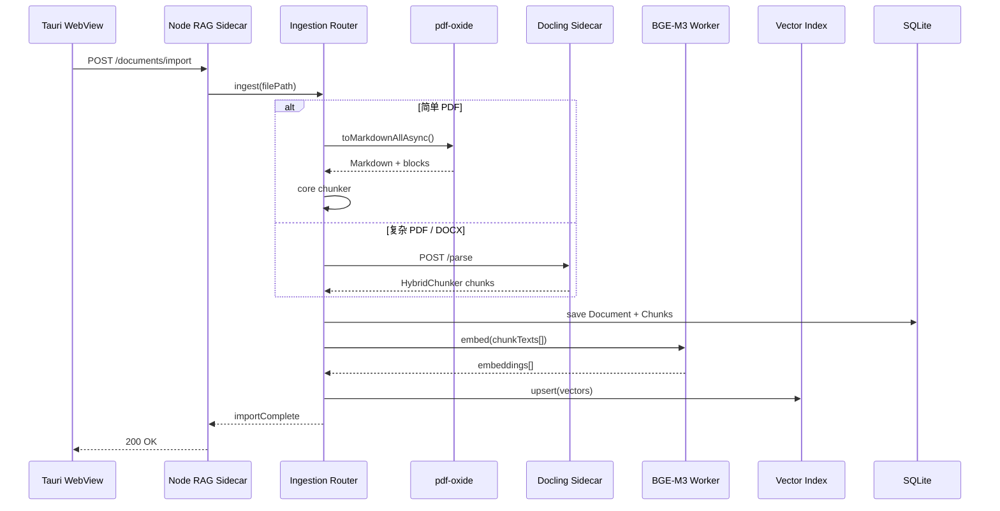
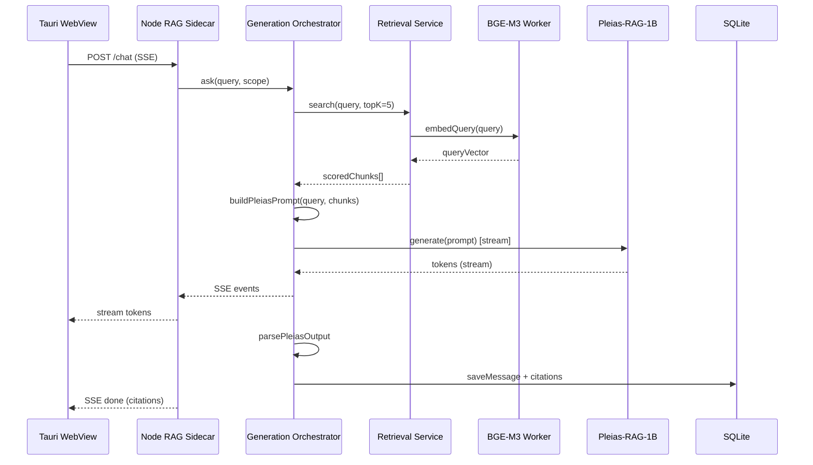

# BlueLamp RAG 应用架构设计

> 基于 **Pleias-RAG-1B** 与 **BGE-M3** 的跨平台本地 RAG 应用  
> 技术栈：TypeScript / JavaScript · **Tauri 2** · 首发 macOS · 后续扩展 Windows

---

## 1. 项目概述

### 1.1 目标

构建一款**完全本地运行**的检索增强生成（RAG）桌面应用，满足以下核心诉求：

| 诉求 | 说明 |
|------|------|
| 可溯源回答 | 生成内容附带原文引用与字面引述，降低幻觉风险 |
| 隐私优先 | 文档、向量、推理均在本地完成，无需上传云端 |
| 轻量部署 | 1B 级生成模型 + 高效嵌入模型，可在消费级硬件上运行 |
| 跨平台演进 | 以 macOS 为首发平台，架构预留 Windows 适配路径 |

### 1.2 模型选型

#### Pleias-RAG-1B（生成 / 推理层）

- **参数量**：约 1.2B，面向 RAG、搜索与来源摘要的小型推理模型
- **核心能力**：
  - 结构化输入/输出（特殊 token 分隔 query、sources、reasoning、answer）
  - 内置引用生成：推理过程中直接产出带字面引述的 citation，而非事后归因
  - Proto-agentic 能力：查询理解、语言检测、查询改写、来源重排、拒答判断
  - 多语言支持，回答语言跟随用户查询语言
- **部署形态**：
  - 官方 [Pleias-RAG-Library](https://github.com/Pleias/Pleias-RAG-Library)（Python，vLLM / Transformers）
  - [GGUF 版本](https://huggingface.co/PleIAs/Pleias-RAG-1B-gguf)（约 2.4 GB，CPU 友好，适合 Node 绑定）

#### BGE-M3（嵌入 / 检索层）

- **来源**：[BAAI/bge-m3](https://huggingface.co/BAAI/bge-m3)
- **核心能力**：
  - 多语言（100+ 语言）稠密向量检索
  - 稀疏检索（lexical matching）与多向量交互（ColBERT 风格）—— 可选启用混合检索
  - 输出维度：1024（dense）
- **JS 运行时**：[Xenova/bge-m3](https://huggingface.co/Xenova/bge-m3) + `@huggingface/transformers`（ONNX，支持 fp16 / q4 量化）

### 1.3 非目标（首版）

- 云端推理或多租户 SaaS
- 实时协作编辑知识库
- 替代专业向量数据库的大规模分布式检索（首版面向单用户本地场景）

---

## 2. 系统架构总览

采用 **Tauri 2 + Node Sidecar** 双进程架构：Tauri 负责轻量 UI 壳与系统集成，Node 进程承载全部 RAG 推理与原生模块。同一 Sidecar 内并行提供 **RAG Chat** 与 **piFlow Agent**（互不替换）。

```
+------------------------------------------------------------------+
|              Tauri WebView (React + TypeScript)                  |
|  Knowledge | RAG Chat | piFlow | Citations | Settings            |
+-----+------------+----------+------------+-----------+-----------+
      |            | HTTP/SSE |            |           |
      |            | localhost|            |           |
+-----v------------v----------v------------v-----------v-----------+
|              Node Sidecar (apps/rag-server :3847)                |
|  Ingestion | Retrieval | Generation Orchestrator | piFlow Agent  |
|  BGE-M3 + SQLite vectors + docs     |  pg-actions / local-fs     |
+-------------------------------+----------------------------------+
                                ^
                                | spawn / paths / dialogs
+-------------------------------v----------------------------------+
|  Tauri Rust Shell (sidecar lifecycle, window, capabilities)      |
+------------------------------------------------------------------+
```

**piFlow 专项设计**（Skill 模型、SSE 协议、Postgres / Local FS、落盘路径）见 **[piflow.md](piflow.md)**。

### 2.1 架构原则

1. **Tauri 只做壳**：Rust 代码限于窗口、Sidecar 启停、系统 API；业务逻辑全部在 TypeScript
2. **Node Sidecar 承载推理**：`node-llama-cpp`、`better-sqlite3` 等原生模块运行在独立 Node 进程，不进入 WebView
3. **接口先行**：`packages/core` 定义 RAG 接口；Sidecar 暴露 HTTP API，前端与测试均可复用
4. **RAG 与 piFlow 并行**：文档问答走 `orchestrator`；工作流 Agent 走 `/piflow/*` + Pi Skills，互不替换
5. **渐进式复杂度**：首版 dense retrieval + Pleias 结构化 prompt；混合检索作为 v2 增强
6. **平台抽象层**：路径、模型目录、硬件探测封装在 `PlatformAdapter`，由 Sidecar 实现、Tauri 注入环境变量

---

## 3. 技术栈选型

### 3.1 确定方案

| 层级 | 技术 | 选型理由 |
|------|------|----------|
| 桌面壳 | **Tauri 2** | 体积小（~5–10 MB）、系统 WebView、成熟打包/签名工具链、跨平台 |
| 前端框架 | **React + TypeScript** | 组件生态丰富，与 Tauri 官方模板一致 |
| 构建工具 | **Vite** | Tauri 官方推荐，HMR 体验好 |
| RAG 后端 | **Node Sidecar**（`apps/rag-server`） | 完整 Node 原生模块支持，与 UI 进程隔离 |
| 前后端通信 | **HTTP + SSE**（localhost） | 简单、可独立调试；流式回答用 Server-Sent Events |
| Tauri ↔ Sidecar | **Tauri Sidecar API** | Rust 侧启动/监控 Node 二进制，随应用退出自动清理 |
| 嵌入模型 | **@huggingface/transformers** + Xenova/bge-m3 | 纯 JS/ONNX，macOS / Windows 一致 |
| 生成模型 | **node-llama-cpp** + Pleias-RAG-1B GGUF | 原生 Node 绑定，无 Python 依赖 |
| 向量检索 | **hnswlib-node** 或 **usearch** | 本地 ANN，npm 可安装 |
| 元数据存储 | **better-sqlite3** | 运行在 Sidecar 进程内 |
| PDF 解析 | **pdf-oxide** | Rust 核心 + Node N-API，快速提取 Markdown/表格，跑在 Node Sidecar |
| 复杂文档解析 | **Docling**（Python Sidecar） | 多格式、版面理解、OCR、内置 HybridChunker |
| DOCX 解析 | **mammoth**（Phase 1）→ Docling（Phase 2） | MVP 轻量；复杂 Word 走 Docling |
| 分块 | **packages/core** + Docling HybridChunker | 结构感知分块，对齐 BGE-M3 token 窗口 |

### 3.2 Tauri + Node Sidecar 分工

| 职责 | Tauri（Rust + WebView） | Node Sidecar |
|------|-------------------------|--------------|
| UI 渲染 | ✅ React | — |
| 文件选择对话框 | ✅ `@tauri-apps/plugin-dialog` | — |
| 应用菜单 / 托盘 | ✅ Tauri API | — |
| 启动 / 停止 RAG 服务 | ✅ Sidecar spawn | — |
| 文档解析 / 分块 | — | ✅ pdf-oxide + core chunker |
| 复杂文档解析 | — | ✅ Docling Sidecar（Phase 2） |
| 嵌入 / 检索 / 生成 | — | ✅ |
| SQLite / 向量索引 | — | ✅ |
| 模型下载与缓存 | 展示进度（UI） | ✅ 实际下载 |

**Rust 代码量预期**：使用 `create-tauri-app` 模板 + Sidecar 配置，日常开发几乎只写 TypeScript。

### 3.3 Sidecar 生命周期

```
应用启动
  → Tauri Rust: spawn_sidecar("rag-server")
  → Node: 加载模型、监听 127.0.0.1:{port}
  → WebView: fetch("/health") 等待就绪
  → 用户操作...

应用退出
  → Tauri: kill sidecar
  → Node: 释放模型、关闭 DB 连接
```

Sidecar 二进制通过 `tauri.conf.json` 的 `bundle.externalBin` 打包，按平台命名：

```
src-tauri/binaries/
├── rag-server-aarch64-apple-darwin
├── rag-server-x86_64-apple-darwin
└── rag-server-x86_64-pc-windows-msvc.exe
```

开发模式下可直接 `node apps/rag-server/dist/index.js`，无需每次编译 Sidecar 二进制。

### 3.4 备选方案（生成层）

若 `node-llama-cpp` 对 Pleias 特殊 token 模板支持不完善，可将生成后端替换为 **Python Sidecar**（同样通过 Tauri Sidecar 机制挂载）：

```
┌──────────────┐   HTTP/SSE    ┌──────────────────┐   内部调用   ┌─────────────────┐
│ Tauri WebView│ ◄───────────► │ Node RAG Sidecar │ ◄──────────► │ Python Sidecar  │
│  (React UI)  │               │ 检索 + 编排       │              │ Pleias-RAG-Lib  │
└──────────────┘               └──────────────────┘              └─────────────────┘
```

首版优先纯 Node 路径，Python 作为降级方案。

### 3.5 文档解析与分块（分层策略）

采用 **分层路由**，按文档复杂度选择解析器，而非单一库包办全部格式：

```
┌─────────────────────────────────────────────────────────────────┐
│                    Ingestion Router（Node Sidecar）               │
├─────────────────────────────────────────────────────────────────┤
│  txt / md / html     →  直接读取 + packages/core chunker        │
│  简单 PDF            →  pdf-oxide → Markdown → core chunker     │
│  复杂 PDF / DOCX /   →  Docling Sidecar → HybridChunker         │
│  扫描件 / 多栏 / 表格 │     （HTTP 子进程调用）                    │
└─────────────────────────────────────────────────────────────────┘
```

#### 库选型对比

| | **pdf-oxide** | **Docling** |
|--|---------------|-------------|
| 运行时 | Node Sidecar（`npm i pdf-oxide`） | Python Sidecar（`pip install docling`） |
| 格式 | 主要 **PDF** | PDF、DOCX、PPTX、XLSX、HTML、图片 OCR 等 |
| 能力 | 文本/Markdown 提取、表格检测、异步 API | 版面理解、阅读顺序、OCR、公式、内置 chunker |
| Chunk | **无**（输出 Markdown，由 core 分块） | `HierarchicalChunker` / `HybridChunker`（含 bbox、页码） |
| 性能 | 极快（~0.8ms/页量级） | 较重，含布局模型，适合质量优先场景 |
| 许可 | MIT / Apache-2.0 | MIT |

#### 路由规则（启发式）

| 条件 | 路由目标 |
|------|----------|
| `.txt` / `.md` / `.html` | 内置文本解析器 |
| `.pdf` 且为可选文字层、页数 < 50 | pdf-oxide |
| `.pdf` 扫描件 / 含大量表格 / 多栏排版 | Docling |
| `.docx` / `.pptx` / `.xlsx` | Docling |
| 用户手动选择「高质量解析」 | Docling |

Phase 1 仅实现 pdf-oxide + 文本格式；Docling Sidecar 在 Phase 2 接入。

---

## 4. 核心模块设计

### 4.1 文档摄取（Ingestion Service）

**职责**：将用户导入的文件转化为可检索的 chunk 与向量。

```
原始文件 → 路由选择解析器 → 结构化文本 → 分块 → 嵌入 → 写入索引
```

#### 4.1.1 解析器抽象

所有解析器统一输出 `ParsedDocument`，供分块器消费：

```typescript
type ParserBackend = 'native' | 'pdf-oxide' | 'docling';

interface ParsedBlock {
  type: 'paragraph' | 'heading' | 'table' | 'list' | 'code';
  text: string;
  level?: number;       // heading level (1–6)
  page?: number;
  bbox?: [number, number, number, number]; // [x0, y0, x1, y1]，Docling 提供
  confidence?: number;
}

interface ParsedDocument {
  title: string;
  mimeType: string;
  backend: ParserBackend;
  blocks: ParsedBlock[];
  markdown?: string;    // pdf-oxide / Docling 可选导出
}

interface DocumentParser {
  canHandle(mimeType: string, hints?: ParseHints): boolean;
  parse(filePath: string, options?: ParseOptions): Promise<ParsedDocument>;
}

interface ParseHints {
  pageCount?: number;
  hasTextLayer?: boolean;
  forceHighQuality?: boolean;  // 用户指定走 Docling
}
```

#### 4.1.2 pdf-oxide（Node，默认 PDF 路径）

在 Node Sidecar 中调用，负责 **PDF → Markdown/结构化文本**：

```typescript
import { PdfDocument } from 'pdf-oxide';

async function parseWithPdfOxide(filePath: string): Promise<ParsedDocument> {
  const doc = await PdfDocument.open(filePath);
  const markdown = await doc.toMarkdownAllAsync({ detectHeadings: true });
  // 将 Markdown 解析为 ParsedBlock[]（按 # 标题、表格边界切分）
  return { title: basename(filePath), mimeType: 'application/pdf', backend: 'pdf-oxide', blocks: markdownToBlocks(markdown), markdown };
}
```

**要点**：

- 使用 `*Async` 方法，避免阻塞 Node 事件循环
- 预编译 N-API 二进制，macOS arm64/x64、Windows x64 开箱可用
- 不提供 chunk，后续交给 `packages/core` 分块器

#### 4.1.3 Docling（Python Sidecar，高质量路径）

通过 HTTP 调用 Python 子服务，负责 **复杂文档 → 已分块结果**：

```python
# apps/docling-sidecar/main.py（示意）
from docling.document_converter import DocumentConverter
from docling.chunking import HybridChunker

converter = DocumentConverter()
chunker = HybridChunker(max_tokens=512, merge_peers=True)

doc = converter.convert(file_path).document
for chunk in chunker.chunk(doc):
    yield {
        "text": chunker.contextualize(chunk),
        "metadata": chunk.meta.export_dict(),  # page, bbox, headings
    }
```

Node Sidecar 通过 `POST /parse` 调用，返回与 `Chunk` 模型对齐的 JSON。

**要点**：

- `HybridChunker` 的 `max_tokens=512` 对齐 BGE-M3 嵌入窗口
- chunk 元数据（`page`、`bbox`、标题层级）直接用于 Pleias 引用溯源 UI
- 首次运行需下载布局/OCR 模型，磁盘与内存开销大于 pdf-oxide
- Tauri 可选将其作为第二个 Sidecar，或 Node 以子进程 `spawn` 管理

#### 4.1.4 分块策略

| 来源 | 策略 | 参数 |
|------|------|------|
| txt / md / html | 标题层级 + 递归字符切分 | `max_tokens=512`，`overlap=10–15%` |
| pdf-oxide 输出 | 按 Markdown `#` 标题切分；**表格整块保留**，不跨块拆分 | 同上 |
| Docling 输出 | 直接使用 `HybridChunker` 结果 | `max_tokens=512`，`merge_peers=True` |

分块后统一 enrich 元数据，写入 `Chunk` 模型：

```typescript
interface Chunk {
  id: string;
  documentId: string;
  content: string;
  metadata: {
    page?: number;
    heading?: string;       // 标题面包屑，如 "Chapter 1 > Section 2"
    charOffset: number;
    bbox?: [number, number, number, number];
    parserBackend: ParserBackend;
    blockType?: ParsedBlock['type'];
  };
  embedding?: Float32Array; // 1024-dim for BGE-M3 dense
}
```

#### 4.1.5 数据模型（Document）

```typescript
interface Document {
  id: string;
  title: string;
  sourcePath: string;
  mimeType: string;
  parserBackend: ParserBackend;
  pageCount?: number;
  createdAt: Date;
  updatedAt: Date;
}
```

> `Chunk` 定义见 §4.1.4，不再重复列出。

#### 4.1.6 Ingestion Router 流程

```typescript
// packages/core/ingestion/router.ts
async function ingest(filePath: string, hints?: ParseHints): Promise<Chunk[]> {
  const route = selectParser(filePath, hints);
  const parsed = await parsers[route].parse(filePath);
  const chunks = route === 'docling'
    ? parsed.blocks.map(toChunk)           // Docling 已分块
    : chunker.split(parsed.blocks);        // pdf-oxide / native 走 core chunker
  const embeddings = await embedder.embed(chunks.map(c => c.content));
  await vectorIndex.upsert(chunks, embeddings);
  return chunks;
}
```

### 4.2 嵌入服务（Embedding Service）

**职责**：加载 BGE-M3，提供批量/单条文本向量化。

```typescript
interface Embedder {
  initialize(options?: EmbedderOptions): Promise<void>;
  embed(texts: string[]): Promise<Float32Array[]>;
  embedQuery(query: string): Promise<Float32Array>;
  dispose(): Promise<void>;
}

interface EmbedderOptions {
  modelId: 'Xenova/bge-m3';
  dtype: 'fp32' | 'fp16' | 'q4';  // macOS Apple Silicon 建议 fp16
  device: 'wasm' | 'webgpu';       // Node 环境默认 wasm
  maxBatchSize: number;
}
```

**实现要点**：

- 在 **Worker Thread**（`worker_threads`）中加载模型，避免阻塞 UI
- 本地优先：从 `models/Xenova/bge-m3/` 加载 ONNX（见 §4.7）；校验失败则自动从镜像重新下载
- Query 与 Document 使用相同 `pooling: 'cls', normalize: true` 配置（与官方示例一致）
- BGE-M3 官方建议在 query 前加 instruction prefix（检索场景）：  
  `"Represent this sentence for searching relevant passages: "` + query

### 4.3 检索服务（Retrieval Service）

**职责**：根据用户 query 返回 Top-K 相关 chunk。

#### 4.3.1 首版：Dense Retrieval

```
query → embedQuery → ANN search (cosine) → Top-K chunks → 可选 rerank
```

```typescript
interface Retriever {
  index(chunks: Chunk[]): Promise<void>;
  search(query: string, topK: number): Promise<ScoredChunk[]>;
  removeByDocumentId(documentId: string): Promise<void>;
}

interface ScoredChunk {
  chunk: Chunk;
  score: number;
}
```

#### 4.3.2 增强版：Hybrid Retrieval（v2）

BGE-M3 同时支持 sparse（lexical）与 multi-vector 检索。在 Transformers.js 侧目前以 dense 为主；若需完整 hybrid，可考虑：

- 本地 BM25（`wink-bm25`）+ dense 分数融合（RRF）
- 或调用 Python 微服务执行 BGE-M3 完整推理管线

### 4.4 生成编排（Generation Orchestrator）

**职责**：将 query + 检索到的 sources 组装为 Pleias 结构化输入，调用生成模型，解析结构化输出。

#### 4.4.1 Pleias 输入格式

Pleias-RAG 模型要求结构化的 query 与 sources。参考官方格式：

```
<|query_start|>{user_query}<|query_end|>
<|source_start|>{source_id_1}<|source_sep|>{source_text_1}<|source_end|>
<|source_start|>{source_id_2}<|source_sep|>{source_text_2}<|source_end|>
...
```

应用层需将检索到的 chunk 映射为带 `source_id` 的来源条目，保留可追溯元数据。

#### 4.4.2 Pleias 输出解析

模型输出包含推理轨迹与最终答案，需解析特殊 token：

```
{reasoning_trace}
<|source_analysis_start|>{source_analysis}<|source_analysis_end|>
<|answer_start|>{answer_with_citations}<|answer_end|>
```

```typescript
interface PleiasResponse {
  reasoning?: string;
  sourceAnalysis: string;
  answer: string;
  citations: Citation[];
}

interface Citation {
  sourceId: string;
  quote: string;
  documentId: string;
  chunkId: string;
}
```

#### 4.4.3 生成后端抽象

```typescript
interface Generator {
  initialize(modelPath: string): Promise<void>;
  generate(prompt: string, options?: GenerateOptions): AsyncIterable<string>;
  dispose(): Promise<void>;
}
```

**node-llama-cpp 实现注意**：

- 加载 `Pleias-RAG-1B.gguf`（约 2.4 GB 未量化版本）
- 配置合适的 `contextSize`（建议 ≥ 8192，视检索 source 数量调整）
- 使用流式输出（`onToken`）实现打字机效果
- macOS Apple Silicon 可启用 Metal 加速；Windows 侧使用 CUDA（如有独显）或 CPU

### 4.5 会话与状态管理

```typescript
interface ChatSession {
  id: string;
  messages: Message[];
  attachedDocumentIds: string[];
  createdAt: Date;
}

interface Message {
  id: string;
  role: 'user' | 'assistant';
  content: string;
  citations?: Citation[];
  retrievalContext?: ScoredChunk[];
}
```

会话历史持久化至 SQLite。首版**不将多轮历史传入 Pleias prompt**（模型针对单轮 QA + sources 优化），多轮能力作为后续迭代。

### 4.7 模型管理与下载（Model Manager）

**职责**：校验本地模型完整性，缺失或格式不对时**主动从国内镜像下载**；支持校验失败后强制重新下载。

#### 4.7.1 模型清单

以 [`models/manifest.json`](../models/manifest.json) 为唯一来源，登记运行时所需模型：

| ID | Hub 模型 | 本地路径 | 运行时 | 说明 |
|----|----------|----------|--------|------|
| `embedding.bge-m3` | [Xenova/bge-m3](https://huggingface.co/Xenova/bge-m3) | `models/Xenova/bge-m3/` | Transformers.js | ONNX fp16，**非** `BAAI/bge-m3` PyTorch 版 |
| `generation.pleias-rag-1b` | [PleIAs/Pleias-RAG-1B-gguf](https://huggingface.co/PleIAs/Pleias-RAG-1B-gguf) | `models/Pleias-RAG-1B/` | node-llama-cpp | `Pleias-RAG-1B.gguf`（~2.4 GB） |

#### 4.7.2 当前仓库状态（`models/bge-m3`）

现有 `models/bge-m3/` 目录为 **`BAAI/bge-m3` sentence-transformers 残留**：

- 仅有 `config.json`、tokenizer 等元数据
- **缺少** `model.safetensors` / `pytorch_model.bin` 等 PyTorch 权重
- **缺少** Transformers.js 所需的 `onnx/*.onnx`

**结论：不能用于本项目的嵌入推理，需在开发任务中重新下载 `Xenova/bge-m3` ONNX 至 `models/Xenova/bge-m3/`。**

#### 4.7.3 国内镜像策略

| 层级 | 配置 |
|------|------|
| 默认镜像 | `https://hf-mirror.com`（HF 国内公益镜像） |
| CLI / 脚本 | `export HF_ENDPOINT=https://hf-mirror.com` |
| Transformers.js | 须在 `pipeline()` 前设置 `env.remoteHost`（库不自动读 `HF_ENDPOINT`） |
| 备用 | 官方 `huggingface.co`（镜像不可用时降级，UI 提示切换网络） |

```typescript
import { env, pipeline } from '@huggingface/transformers';

function configureModelMirror() {
  const host = process.env.HF_ENDPOINT
    ?? process.env.BLUELAMP_HF_MIRROR
    ?? 'https://hf-mirror.com';
  env.remoteHost = host.endsWith('/') ? host : `${host}/`;
  env.allowLocalModels = true;
  env.localModelPath = process.env.BLUELAMP_MODELS_DIR
    ?? path.resolve(process.cwd(), 'models');
  // 开发：本地优先；缺失文件时 allowRemoteModels 触发镜像下载
  env.allowRemoteModels = true;
}
```

#### 4.7.4 ModelManager 接口

```typescript
type ModelStatus = 'ready' | 'missing' | 'incomplete' | 'downloading' | 'error';

interface ModelManifestEntry {
  id: string;
  hubId: string;
  localDir: string;
  requiredFiles: string[];
  dtype?: string;
  download: { mirror: string; official: string };
}

interface ModelManager {
  loadManifest(): Promise<ModelManifestEntry[]>;
  validate(modelId: string): Promise<{ status: ModelStatus; missingFiles: string[] }>;
  ensure(modelId: string, options?: { force?: boolean }): Promise<void>;
  download(modelId: string, onProgress?: (p: DownloadProgress) => void): Promise<void>;
  getLocalPath(modelId: string): string;
}

interface DownloadProgress {
  modelId: string;
  file: string;
  downloadedBytes: number;
  totalBytes?: number;
  percent?: number;
}
```

**启动流程**（rag-server）：

```
1. ModelManager.loadManifest()
2. 并行 ensure('embedding.bge-m3') + ensure('generation.pleias-rag-1b')
3. 任一失败 → 返回 /health { status: 'degraded', models: [...] }，UI 展示下载进度/重试
4. 全部 ready → 加载 Embedder + Generator
```

**校验规则**：

- 逐文件检查 `manifest.requiredFiles` 是否存在且 size > 0
- `force: true` 时删除 `localDir` 后重新下载
- 下载使用镜像 URL，支持断点续传（Phase 2 UI；Phase 1 CLI/脚本 + 简单 HTTP 流）

#### 4.7.5 下载实现（Phase 1）

| 方式 | 用途 |
|------|------|
| `pnpm models:ensure` | 开发脚本：读 manifest，校验并下载缺失模型 |
| `pnpm models:download -- --force embedding.bge-m3` | 强制重新下载指定模型 |
| rag-server 启动时 `ensure()` | 运行时自动补全缺失模型 |
| 设置页「重新下载模型」 | Phase 2 UI，调用 `POST /models/{id}/download?force=1` |

脚本优先调用 `huggingface-cli`（配合 `HF_ENDPOINT`）；无 CLI 时回退到直接 HTTP 拉取 `hf-mirror.com/{hubId}/resolve/main/{file}`。

#### 4.7.6 路径约定

| 环境 | `BLUELAMP_MODELS_DIR` / `env.localModelPath` |
|------|-----------------------------------------------|
| 开发（仓库内） | `{repoRoot}/models` |
| 生产（用户目录） | `~/Library/Application Support/BlueLamp/models`（macOS） |

Transformers.js 加载本地模型时，`pipeline('feature-extraction', 'Xenova/bge-m3')` 会解析为 `{localModelPath}/Xenova/bge-m3/`。

---

## 5. 端到端数据流

### 5.1 文档导入流程



### 5.2 问答流程



---

## 6. 目录结构（建议）

```
bluelamp/
├── apps/
│   ├── desktop/                    # Tauri 2 桌面应用
│   │   ├── src/                    # React 前端（WebView）
│   │   │   ├── components/
│   │   │   ├── pages/
│   │   │   ├── hooks/
│   │   │   ├── api/                # 调用 rag-server HTTP API
│   │   │   └── main.tsx
│   │   ├── src-tauri/              # Rust 壳（极简）
│   │   │   ├── src/
│   │   │   │   ├── main.rs         # 窗口 + Sidecar 启停
│   │   │   │   └── lib.rs
│   │   │   ├── binaries/           # Sidecar 二进制（按平台命名）
│   │   │   ├── capabilities/       # Tauri 2 权限配置
│   │   │   ├── tauri.conf.json
│   │   │   └── Cargo.toml
│   │   ├── index.html
│   │   ├── vite.config.ts
│   │   └── package.json
│   └── rag-server/                 # Node RAG Sidecar
│       ├── src/
│       │   ├── index.ts            # HTTP 服务入口
│       │   ├── routes/             # /chat, /documents, /health, /piflow/*
│       │   ├── services/
│       │   │   ├── ingestion/      # Router + pdf-oxide 适配器
│       │   │   ├── retrieval/
│       │   │   ├── generation/
│       │   │   ├── piflow/         # Pi Agent 装配、会话、Skill 设置
│       │   │   └── model-manager.ts  # 校验 / 镜像下载 / ensure
│       │   ├── parsers/
│       │   │   ├── pdf-oxide.ts
│       │   │   ├── native.ts       # txt / md / html
│       │   │   └── docling-client.ts  # 调用 Docling Sidecar
│       │   ├── workers/            # embedder.worker.ts
│       │   └── platform/
│       ├── skills/                 # piFlow SKILL.md（postgres / local-fs / no-delete）
│       ├── scripts/
│       │   └── bundle-sidecar.ts
│       └── package.json
│   └── docling-sidecar/            # Python，Phase 2 接入
│       ├── main.py                 # FastAPI / parse 端点
│       ├── requirements.txt
│       └── pyproject.toml
├── packages/
│   ├── core/                       # RAG 核心逻辑（纯 TS，可单测）
│   │   ├── ingestion/
│   │   │   ├── router.ts
│   │   │   ├── chunker.ts          # 标题感知 + 递归切分
│   │   │   └── types.ts            # ParsedDocument, Chunk
│   │   ├── retrieval/
│   │   ├── generation/
│   │   └── types/
│   ├── pg-actions/                 # piFlow Postgres 只读 tools
│   └── pleias-parser/
├── docs/
│   ├── architecture.md
│   ├── piflow.md                   # piFlow Agent 设计
│   ├── user-manual.zh.md
│   └── adr/
│       ├── 001-tauri-sidecar.md
│       ├── 002-document-parsing.md
│       ├── 003-model-management.md
│       └── 004-wsl-dev-macos-release.md
├── models/
│   ├── manifest.json               # 模型清单（路径、必填文件、镜像 URL）
│   ├── README.md
│   ├── Xenova/bge-m3/              # ✅ 目标：Transformers.js ONNX
│   └── Pleias-RAG-1B/              # ✅ 目标：GGUF
│   # models/bge-m3/                # ⚠️ 已废弃，BAAI PyTorch 残留，待删除/覆盖
├── scripts/
│   └── models-ensure.ts            # pnpm models:ensure
├── package.json                    # monorepo root (pnpm workspaces)
└── pnpm-workspace.yaml
```

---

## 7. 平台适配策略

### 7.0 开发流程：WSL → macOS

```
┌─────────────────────────────────────────────────────────────┐
│  Phase A — WSL 开发（当前）                                   │
│  pnpm dev:server + pnpm dev:ui（浏览器）                      │
│  完整 RAG 链路、UI、模型、文档导入均在 Linux 上验证              │
└───────────────────────────┬─────────────────────────────────┘
                            │ 功能验收通过
                            ▼
┌─────────────────────────────────────────────────────────────┐
│  Phase B — macOS 发布                                         │
│  tauri dev / tauri build · Metal · Sidecar 打包 · 签名公证    │
└─────────────────────────────────────────────────────────────┘
```

详细命令与环境见 [development-wsl.md](development-wsl.md)。

| WSL 可完成 | 留到 macOS |
|------------|------------|
| React UI、API 联调 | Tauri 窗口与系统集成 |
| BGE-M3 / Pleias / pdf-oxide（CPU） | Metal 加速验证 |
| SQLite、向量索引、文档导入 | `.app` 打包与公证 |
| `pnpm models:ensure` | Sidecar 二进制打入 bundle |

### 7.1 macOS（首发发布目标）

| 关注点 | 方案 |
|--------|------|
| WebView | WKWebView（Tauri 内置） |
| 硬件加速 | BGE-M3：WASM；Pleias：Metal via llama.cpp |
| 模型缓存路径 | `~/Library/Application Support/BlueLamp/models/` |
| 用户数据路径 | `~/Library/Application Support/BlueLamp/data/` |
| Sidecar 路径 | Tauri 通过 `app.path().resource_dir()` 定位二进制 |
| 内存建议 | ≥ 16 GB RAM |
| 代码签名 | Apple Developer 证书 + `tauri build` 公证（Notarization） |
| Tauri 权限 | `capabilities/default.json` 配置 dialog、fs、shell sidecar |

### 7.2 Windows（后续）

| 关注点 | 方案 |
|--------|------|
| WebView | WebView2（Tauri 内置，首次运行可能触发运行时安装） |
| 硬件加速 | CUDA（NVIDIA）或 CPU fallback |
| 模型缓存路径 | `%APPDATA%\BlueLamp\models\` |
| 路径处理 | Sidecar 内统一 `path.join` |
| Sidecar 二进制 | `rag-server-x86_64-pc-windows-msvc.exe` |
| 原生模块 | `node-llama-cpp` 等随 Sidecar 用 `pkg` / `esbuild` 打包进二进制 |
| 安装包 | Tauri bundler（NSIS / MSI） |

### 7.3 WSL 开发环境

| 关注点 | 方案 |
|--------|------|
| 日常 UI 调试 | 浏览器访问 `http://localhost:1420`（WSL 端口转发） |
| RAG 服务 | `http://127.0.0.1:3847`，与生产相同 HTTP API |
| 仓库路径 | `~/workspace/...`（Linux 文件系统），避免 `/mnt/c/` |
| 原生模块 | Linux x64-gnu 预编译（pdf-oxide、node-llama-cpp 等） |
| Tauri 窗口 | 可选；需 WSLg + Rust + apt 依赖，非日常必需 |
| 模型目录 | `{repo}/models`，与 macOS 开发一致 |
| 内存 | 建议 `.wslconfig` 分配 ≥ 16 GB（加载模型） |

WSL 下 `BLUELAMP_DATA_DIR` 未设置时，数据目录默认为 `~/.local/share/BlueLamp/`（后续 `paths.ts` 实现）。

### 7.4 平台抽象

Sidecar 通过环境变量接收 Tauri 注入的路径：

```typescript
// apps/rag-server/src/platform/paths.ts
const APP_DATA = process.env.BLUELAMP_DATA_DIR
  ?? path.join(os.homedir(), 'Library/Application Support/BlueLamp');

export const paths = {
  data: APP_DATA,
  models: path.join(APP_DATA, 'models'),
  db: path.join(APP_DATA, 'data', 'bluelamp.db'),
};
```

Tauri 启动 Sidecar 时注入：

```rust
// src-tauri/src/main.rs（示意）
Command::new_sidecar("rag-server")?
    .env("BLUELAMP_DATA_DIR", app_data_dir)
    .spawn()?;
```

前端系统 API（文件对话框等）通过 `@tauri-apps/api` 调用，业务 API 走 HTTP：

```typescript
interface PlatformAdapter {
  getAppDataDir(): Promise<string>;      // Tauri invoke
  openFileDialog(): Promise<string[]>;   // Tauri plugin-dialog
  getRagServerUrl(): string;             // http://127.0.0.1:{port}
}
```

---

## 8. 性能与资源预算

### 8.1 模型资源占用（估算）

| 组件 | 磁盘 | 内存（运行时） | 备注 |
|------|------|----------------|------|
| BGE-M3 (fp16) | ~1.1 GB | ~1.5 GB | 首次下载后本地缓存 |
| Pleias-RAG-1B GGUF | ~2.4 GB | ~3–4 GB | 未量化版本 |
| 向量索引 (10万 chunk) | ~400 MB | ~400 MB | 1024-dim × 100K |
| SQLite + 文件 | 视文档量 | < 100 MB | 元数据 |

**推荐最低配置**：16 GB RAM，10 GB 可用磁盘空间。

### 8.2 延迟目标（macOS M 系列，本地单用户）

| 阶段 | 目标 |
|------|------|
| Query 嵌入 | < 200 ms |
| 向量检索 (10万向量) | < 50 ms |
| Pleias 生成（含推理轨迹） | 5–20 s（与官方 benchmark 一致） |
| 首 token 流式输出 | < 3 s |

### 8.3 优化手段

- 嵌入批处理：导入时 batch size = 8–16
- 模型预热：应用启动后后台加载，避免首次问答冷启动
- 量化：BGE-M3 使用 `fp16` 或 `q4`；Pleias 可评估 Q4_K_M 量化版本（若发布）
- 索引持久化：向量索引序列化到磁盘，避免每次启动重建

---

## 9. 安全与隐私

| 维度 | 策略 |
|------|------|
| 数据驻留 | 所有文档、向量、会话均存储在本地用户目录 |
| 网络访问 | 首次/缺失模型时从 **hf-mirror.com** 下载；可配置 `BLUELAMP_HF_MIRROR` |
| 文件访问 | 通过系统文件对话框显式授权，遵循 macOS sandbox / Windows 权限模型 |
| 依赖审计 | 定期 `npm audit`，锁定原生模块版本 |
| 日志 | 默认不记录文档内容；可配置诊断日志级别 |

---

## 10. 可观测性

```typescript
interface RAGMetrics {
  ingestionDurationMs: number;
  embeddingDurationMs: number;
  retrievalDurationMs: number;
  generationDurationMs: number;
  tokensGenerated: number;
  chunksRetrieved: number;
}
```

- 应用内「诊断」面板展示各环节耗时
- 可选导出匿名性能报告（不含用户内容）用于优化

---

## 11. 分阶段交付计划

### Phase 1 — MVP

**WSL 阶段（当前）**

- [x] Monorepo 脚手架（pnpm + Tauri 2 + React/Vite）
- [x] Node RAG Sidecar 骨架（HTTP API + health check）
- [ ] BGE-M3 嵌入 Worker + 向量索引
- [ ] pdf-oxide PDF 解析 + `packages/core` 结构感知分块
- [ ] 文档导入（txt, md, pdf）
- [ ] Pleias-RAG-1B GGUF 推理 + SSE 流式输出
- [ ] 基础对话 UI + 引用展示
- [ ] SQLite 持久化
- [ ] **模型清单** + `pnpm models:ensure` + 启动时 `ensure()`

**macOS 阶段（WSL 功能验收后）**

- [ ] Tauri Sidecar 启停与 `tauri dev` 联调
- [ ] Sidecar 二进制 macOS 打包（`src-tauri/binaries/`）
- [ ] Metal 推理性能验证
- [ ] `tauri build` + 代码签名 / 公证

### Phase 2 — 体验增强

- [ ] Docling Python Sidecar（复杂 PDF、DOCX、扫描件、表格）
- [ ] Ingestion Router 启发式路由 + 用户「高质量解析」开关
- [ ] 更多文档格式（pptx, xlsx, html）
- [ ] 混合检索（BM25 + dense RRF）
- [ ] 模型下载 **UI**（进度条、断点续传、`force` 重新下载）
- [ ] 推理轨迹可视化（Pleias reasoning trace）
- [ ] 深色模式、快捷键

### Phase 3 — Windows 适配

- [ ] Sidecar Windows 二进制打包（`pkg` / `esbuild`）
- [ ] Tauri Windows CI 构建矩阵
- [ ] WebView2 运行时检测与提示
- [ ] CUDA 自动探测与配置
- [ ] Windows 安装包（NSIS / MSI）

### Phase 4 — 高级能力

- [ ] 多知识库 / 集合隔离
- [ ] Python Sidecar 可选后端
- [ ] 多轮对话上下文管理
- [ ] 插件化文档源（Notion、网页抓取）

---

## 12. 风险与缓解

| 风险 | 影响 | 缓解措施 |
|------|------|----------|
| Pleias 特殊 token 在 node-llama-cpp 中模板不匹配 | 生成质量下降 | 参考官方 chat template；备选 Python Sidecar |
| BGE-M3 在 Node WASM 下加载慢 / 内存高 | 首次体验差 | fp16/q4 量化；Worker 预热；进度提示 |
| Sidecar 打包跨平台失败 | Windows 延期 | CI 矩阵提前验证；开发期直接用 `node` 启动 |
| Sidecar 端口冲突 / 启动失败 | 应用不可用 | 动态端口 + health check；UI 展示重试 |
| Tauri WebView 与系统 WebKit 差异 | UI 兼容问题 | 限定支持的 CSS/JS 特性；macOS/Windows 分别测试 |
| Pleias 输出解析脆弱 | 引用展示异常 | 独立 `pleias-parser` 包 + 快照测试 |
| pdf-oxide 对扫描 PDF 无 OCR | 提取为空 | 路由到 Docling；UI 提示切换高质量解析 |
| Docling 模型体积大 / 首次慢 | 导入体验差 | 懒加载；仅复杂文档触发；进度条 |
| Docling Sidecar 跨平台打包复杂 | Windows 延期 | Phase 2 再接入；macOS 先验证 |
| `models/bge-m3` 格式错误 / 缺权重 | 嵌入无法加载 | 迁移至 `Xenova/bge-m3` ONNX；manifest 校验 + 自动重下 |
| 国内网络无法访问 huggingface.co | 模型下载失败 | 默认 hf-mirror.com；`env.remoteHost` 显式配置 |
| 16 GB 以下内存设备 OOM | 无法运行 | 启动时内存检测；推荐配置提示；考虑 350M 模型降级 |

---

## 13. 关键依赖版本（参考）

```json
{
  "@tauri-apps/api": "^2.x",
  "@tauri-apps/plugin-dialog": "^2.x",
  "@tauri-apps/plugin-shell": "^2.x",
  "@huggingface/transformers": "^3.x",
  "pdf-oxide": "^0.3.x",
  "mammoth": "^1.x",
  "node-llama-cpp": "^3.x",
  "better-sqlite3": "^11.x",
  "hnswlib-node": "^3.x",
  "react": "^19.x",
  "typescript": "^5.x"
}
```

Python（`apps/docling-sidecar`，Phase 2）：

```text
docling>=2.x
fastapi>=0.1xx
uvicorn>=0.3x
```

> 实际版本在脚手架初始化时锁定，并以 CI 定期验证兼容性。

---

## 14. 参考资料

- [Tauri 2 文档](https://v2.tauri.app/)
- [Tauri Sidecar 指南](https://v2.tauri.app/develop/sidecar/)
- [create-tauri-app](https://v2.tauri.app/start/create-project/)
- [Pleias-RAG-1B — Hugging Face](https://huggingface.co/PleIAs/Pleias-RAG-1B)
- [Pleias-RAG-1B GGUF](https://huggingface.co/PleIAs/Pleias-RAG-1B-gguf)
- [Pleias-RAG-Library](https://github.com/Pleias/Pleias-RAG-Library)
- [Pleias-RAG 论文 (arXiv)](https://arxiv.org/html/2504.18225)
- [BAAI/bge-m3](https://huggingface.co/BAAI/bge-m3)
- [Xenova/bge-m3 (Transformers.js)](https://huggingface.co/Xenova/bge-m3)
- [HF Mirror 国内镜像](https://hf-mirror.com)
- [@huggingface/transformers 文档](https://huggingface.co/docs/transformers.js)
- [node-llama-cpp](https://github.com/withcatai/node-llama-cpp)
- [pdf-oxide — Node.js 文档](https://pdf.oxide.fyi/docs/getting-started/javascript-node)
- [pdf-oxide — GitHub](https://github.com/yfedoseev/pdf_oxide)
- [Docling 文档](https://docling-project.github.io/docling/)
- [Docling Chunking 指南](https://docling-project.github.io/docling/concepts/chunking/)
- [Docling 技术报告 (arXiv)](https://arxiv.org/pdf/2408.09869)

---

## 附录 A：Pleias Prompt 组装示例

```typescript
function buildPleiasPrompt(query: string, chunks: ScoredChunk[]): string {
  const sources = chunks
    .map((sc, i) =>
      `<|source_start|>src_${i}<|source_sep|>${sc.chunk.content}<|source_end|>`
    )
    .join('\n');

  return [
    `<|query_start|>${query}<|query_end|>`,
    sources,
  ].join('\n');
}
```

## 附录 B：BGE-M3 嵌入调用示例

```typescript
import { env, pipeline } from '@huggingface/transformers';
import path from 'node:path';

// 国内镜像 + 本地 models/ 目录（须在 pipeline 之前）
env.remoteHost = process.env.HF_ENDPOINT ?? 'https://hf-mirror.com/';
env.allowLocalModels = true;
env.localModelPath = path.resolve(process.cwd(), 'models');
env.allowRemoteModels = true;

const extractor = await pipeline('feature-extraction', 'Xenova/bge-m3', {
  dtype: 'fp16',
});

const QUERY_PREFIX = 'Represent this sentence for searching relevant passages: ';

async function embedQuery(query: string) {
  const result = await extractor(QUERY_PREFIX + query, {
    pooling: 'cls',
    normalize: true,
  });
  return new Float32Array(result.data);
}
```

---

*文档版本：v0.6 · 最后更新：2026-08-07 · 增补：内置 piFlow（见 [piflow.md](piflow.md)）*
