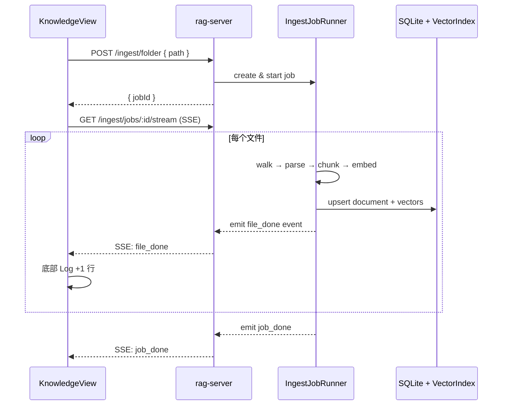

# Knowledge Base — 目录导入设计

> 状态：**已确认**（2026-07-01）  
> 范围：选择目录 → 后台遍历 → 解析 / 分块 / 向量化 / 建索引 → 页面底部活动日志  
> 测试环境：**Windows**（优先）；`rag-server` 可跑在 WSL，UI 在 Windows 浏览器或 Tauri

---

## 1. 目标与非目标

### 1.1 目标

| 目标 | 说明 |
|------|------|
| 目录级导入 | 用户选择一个文件夹，递归处理其中所有支持的文档 |
| 后台执行 | 不阻塞 UI；导入在 `rag-server` 进程内异步 Job 中运行 |
| 可观测进度 | 页面底部展示已完成任务；**优先每完成一个文件更新一次** |
| 持久索引 | 向量写入本地索引，文档元数据写入 SQLite，可供对话检索 |

### 1.2 非目标（首版）

- 单文件选择（可后续加，首版只做目录）
- 导入过程中暂停/恢复单个文件（仅支持整 Job 取消）
- Docling 复杂路由（Phase 1 统一 pdf-oxide + native）
- 多 Job 并行（首版同一时间只允许 **1 个** 活跃导入 Job）

---

## 2. 用户交互流程

```
用户进入 Knowledge Base
    → 点击「Import folder」
    → 选择目录（见 §3.1）
    → 确认后开始导入
    → 列表区显示已索引文档（可增量刷新）
    → 底部 Activity Log 逐条追加「已完成」记录
    → 全部结束：显示汇总（成功 N / 跳过 M / 失败 K）
```



---

## 3. 前端设计（Knowledge Base 页面）

### 3.1 目录选择

| 环境 | 方式 |
|------|------|
| **Windows + Tauri**（推荐测试） | `@tauri-apps/plugin-dialog` → 系统「选择文件夹」对话框 |
| **Windows + 浏览器**（`pnpm dev:ui`） | 弹窗内输入 **Windows 绝对路径**，如 `C:\Users\you\Documents\papers`；`rag-server` 需能访问该路径（见下） |

**Windows 测试时注意路径可达性**

| rag-server 运行位置 | 前端传入路径示例 | 是否可用 |
|-------------------|------------------|----------|
| **Windows 本机** Node | `C:\Users\you\docs` | ✅ 直接可用 |
| **WSL** 内 Node，文档在 Windows 盘 | `/mnt/c/Users/you/docs` | ✅ 用 WSL 路径 |
| **WSL** 内 Node，传 `C:\...` | `C:\Users\you\docs` | ❌ 需前端或 API 转换为 `/mnt/c/...` |

首版实现：**API 接受绝对路径字符串**；Windows 浏览器测试时用户填 `C:\...` 或 `/mnt/c/...`（与 server 所在环境一致）。Tauri 集成后由系统对话框返回路径，无需手输。

### 3.2 页面布局

```
┌──────────────────────────────────────────────────────────────┐
│  Knowledge Base                         [ Import folder ]    │
├──────────────────────────────────────────────────────────────┤
│  ┌─ 统计条 ─────────────────────────────────────────────┐   │
│  │  Indexed: 128 docs · 4,521 chunks · Last import: …    │   │
│  └──────────────────────────────────────────────────────┘   │
│                                                              │
│  ┌─ 文档列表（可滚动）──────────────────────────────────┐   │
│  │  Name              Type    Chunks   Imported            │   │
│  │  report.pdf        PDF    42      2026-07-01 12:01     │   │
│  │  readme.md         MD     8       2026-07-01 11:50     │   │
│  │  …                                                     │   │
│  └──────────────────────────────────────────────────────┘   │
│                                                              │
│  ┌─ 当前 Job 进度（导入进行中显示）──────────────────────┐   │
│  │  ████████░░░░  12 / 30 files                            │   │
│  │  Processing: docs/chapter2.pdf                           │   │
│  └──────────────────────────────────────────────────────┘   │
│                                                              │
│  ┌─ Activity Log（底部固定，高度 ~120px，可滚动）─────────┐   │
│  │  ✓ docs/a.pdf — 42 chunks indexed          12:01:03   │   │
│  │  ✓ docs/b.md — 8 chunks indexed            12:01:05   │   │
│  │  ⊘ docs/tmp.bin — skipped (unsupported)    12:01:05   │   │
│  │  ✗ docs/c.pdf — failed: parse error        12:01:08   │   │
│  └──────────────────────────────────────────────────────┘   │
└──────────────────────────────────────────────────────────────┘
```

### 3.3 底部 Activity Log 规则

| 规则 | 说明 |
|------|------|
| **更新时机** | 首选：**每完成一个文件**（`done` / `skipped` / `failed`）立即追加一行 |
| **降级方案** | 若 SSE 不可用，前端每 **10 秒** `GET /ingest/jobs/:id` 轮询，对比 `completedAt` 增量追加 |
| **显示条数** | 最多保留 **200 行**（内存）；更早的可从 `GET /ingest/jobs/:id/log` 拉历史 |
| **行格式** | `{icon} {relativePath} — {summary} {HH:mm:ss}` |
| **图标** | `✓` 成功 · `⊘` 跳过 · `✗` 失败 · `⋯` 进行中（仅进度条区，不进 Log） |

示例文案：

```
✓ papers/report.pdf — 42 chunks indexed
⊘ .git/config — skipped (hidden path)
✗ scan.pdf — failed: empty text layer
```

### 3.4 前端状态

```typescript
interface KnowledgeViewState {
  documents: DocumentSummary[];      // GET /documents
  activeJob: IngestJob | null;       // 当前导入 Job
  activityLog: ActivityLogEntry[];   // 底部日志（追加式）
  importDialogOpen: boolean;
  folderPath: string;                // WSL 路径输入
}

interface ActivityLogEntry {
  id: string;
  jobId: string;
  relativePath: string;
  status: 'done' | 'skipped' | 'failed';
  summary: string;                   // "42 chunks indexed"
  timestamp: string;                 // ISO
}
```

---

## 4. 后端设计（rag-server）

### 4.1 API 一览

| 方法 | 路径 | 说明 |
|------|------|------|
| `POST` | `/ingest/folder` | 启动目录导入，body: `{ path: string }` |
| `GET` | `/ingest/jobs/:id` | 查询 Job 快照（轮询用） |
| `GET` | `/ingest/jobs/:id/stream` | **SSE** 推送进度（推荐） |
| `POST` | `/ingest/jobs/:id/cancel` | 取消 Job |
| `GET` | `/ingest/jobs/active` | 是否有进行中的 Job |
| `GET` | `/documents` | 已索引文档列表 |
| `DELETE` | `/documents/:id` | 删除文档及向量（后续） |

### 4.2 启动导入

**请求**

```http
POST /ingest/folder
Content-Type: application/json

{ "path": "/home/yong/workspace/docs" }
```

**响应** `202 Accepted`

```json
{
  "jobId": "job_01HY...",
  "rootPath": "/home/yong/workspace/docs",
  "status": "running",
  "totalFiles": 30
}
```

**错误**

| 状态码 | 场景 |
|--------|------|
| 400 | 路径为空、不存在、非目录 |
| 409 | 已有活跃 Job |
| 403 | 路径不在允许范围内（安全策略，见 §6） |

### 4.3 目录遍历

```typescript
const SUPPORTED_EXT = new Set(['.pdf', '.md', '.markdown', '.txt', '.html', '.htm']);

const SKIP_DIR_NAMES = new Set([
  'node_modules', '.git', '.svn', '__pycache__', 'models', 'dist', 'target',
]);

const MAX_FILE_BYTES = 50 * 1024 * 1024;  // 50 MB
const MAX_FILES_PER_JOB = 500;            // 首版上限，可配置
```

遍历逻辑：

1. `fs.readdir` 递归（`fs.promises` + 队列，避免深度递归爆栈）
2. 跳过：隐藏文件/目录（`.` 开头）、`SKIP_DIR_NAMES`
3. 扩展名不在 `SUPPORTED_EXT` → 计入 `skipped`，**不写 Log 或写一行 skipped**（可配置）
4. 超过 `MAX_FILE_BYTES` → `skipped` + 原因 `file too large`
5. 超过 `MAX_FILES_PER_JOB` → 停止扫描并警告

输出：`IngestFileTask[]`（`pending` 状态），再交给 Runner 顺序执行。

### 4.4 单文件处理流水线

```
pending → parsing → chunking → embedding → indexing → done
                                              ↘ failed (任意阶段)
```

| 阶段 | 动作 |
|------|------|
| parsing | 按扩展名路由：`pdf-oxide` / `native`（txt,md,html） |
| chunking | `packages/core` 结构感知分块 |
| embedding | BGE-M3 Worker 批量 embed（batch=8） |
| indexing | SQLite 写 `documents` + `chunks`；向量 upsert ANN |

**并发策略（首版）**：文件 **串行** 处理（避免 BGE-M3 多 Worker OOM）；单文件内 chunk **批量** embed。

### 4.5 Job 数据模型

```typescript
type JobStatus = 'pending' | 'running' | 'completed' | 'failed' | 'cancelled';
type FileTaskStatus =
  | 'pending' | 'parsing' | 'chunking' | 'embedding' | 'indexing'
  | 'done' | 'failed' | 'skipped';

interface IngestJob {
  id: string;
  rootPath: string;
  status: JobStatus;
  createdAt: string;
  startedAt?: string;
  finishedAt?: string;
  cancelRequested: boolean;
  stats: {
    total: number;
    pending: number;
    done: number;
    failed: number;
    skipped: number;
    chunksIndexed: number;
  };
  files: IngestFileTask[];
  currentFileId?: string;           // 正在处理的文件
}

interface IngestFileTask {
  id: string;
  absolutePath: string;
  relativePath: string;             // 相对 rootPath，用于 Log 展示
  mimeType: string;
  status: FileTaskStatus;
  error?: string;
  chunkCount?: number;
  startedAt?: string;
  completedAt?: string;
}
```

**持久化**：Job 元数据与 `files` 表写入 SQLite（`ingest_jobs`, `ingest_file_tasks`），服务重启后可查历史；**活跃 Runner 仅在内存**，重启后 Job 标为 `failed`（`interrupted`）。

### 4.6 进度推送：SSE（推荐）

```
GET /ingest/jobs/:id/stream
Accept: text/event-stream
```

**事件类型**

| event | data 示例 | 触发时机 |
|-------|-----------|----------|
| `file_started` | `{ fileId, relativePath }` | 开始处理某文件 |
| `file_done` | `{ fileId, relativePath, chunkCount, status:"done" }` | 单文件成功 |
| `file_skipped` | `{ fileId, relativePath, reason }` | 跳过 |
| `file_failed` | `{ fileId, relativePath, error }` | 失败 |
| `job_progress` | `{ done, total, currentPath }` | 可选，进度条用 |
| `job_done` | `{ stats }` | 整 Job 结束 |
| `heartbeat` | `{}` | 每 15s，防连接断开 |

前端 `EventSource` 监听 `file_done` / `file_failed` / `file_skipped` → **立即**追加 Activity Log 一行。

### 4.7 轮询降级（10 秒）

当 SSE 连接失败（如部分代理环境）：

```typescript
// 每 10s
const job = await GET(`/ingest/jobs/${jobId}`);
const newEntries = diffByCompletedAt(prev.files, job.files);
appendToActivityLog(newEntries);
```

`diff` 依据 `completedAt` 或 `status` 从非终态变为终态的文件。

---

## 5. 模块划分

```
apps/rag-server/src/
├── routes/
│   ├── ingest.ts          # POST folder, GET job, SSE stream, cancel
│   └── documents.ts       # GET list
├── services/
│   └── ingestion/
│       ├── job-store.ts       # SQLite + 内存活跃 Job
│       ├── folder-walker.ts   # 目录遍历
│       ├── job-runner.ts      # 串行执行 file tasks
│       ├── parsers/           # pdf-oxide, native
│       └── pipeline.ts        # parse → chunk → embed → index
└── workers/
    └── embedder.worker.ts

apps/desktop/src/
├── components/
│   ├── KnowledgeView.tsx
│   ├── ImportFolderDialog.tsx
│   ├── DocumentTable.tsx
│   ├── IngestProgressBar.tsx
│   └── ActivityLog.tsx          # 底部 Label 区域
└── hooks/
    └── useIngestJob.ts          # SSE + 10s fallback
```

---

## 6. 安全与路径策略

| 策略 | Windows 测试 | Tauri 生产 |
|------|--------------|------------|
| 路径校验 | 绝对路径、`fs.stat` 为目录 | 系统对话框返回路径 |
| 路径格式 | `C:\...` 或 `/mnt/c/...`（与 server 环境一致） | 原生 Windows 路径 |
| 禁止符号链接逃出 | `realpath` 解析后须在 root 下 | 同左 |
| 隐藏目录 | **跳过** `.git`、`.xxx` 等（已确认） | 同左 |

---

## 7. 性能与资源

### 7.1 参数一览

| 参数 | 建议值 |
|------|--------|
| 单 Job 最大文件数 | 500 |
| 单文件最大体积 | 50 MB |
| embed batch size | 8 |
| 文件处理并发 | 1（串行） |
| SSE heartbeat | 15s |
| 轮询间隔（降级） | 10s |
| Activity Log UI 保留 | 200 行 |

### 7.2 为何限制「500 文件 / 50MB」？（详细说明）

这是 **单次「导入文件夹」任务** 的保护上限，不是知识库总容量上限。

#### 单 Job 最多 500 个文件

含义：用户点一次 Import folder，递归扫描后，**最多处理 500 个符合扩展名的文件**；第 501 个及以后不再入队，并在 Activity Log 写一行汇总跳过，例如：

```
⊘ — import limit reached (500 files max), 23 files not scanned
```

为什么需要：

| 原因 | 说明 |
|------|------|
| 防止误选大目录 | 例如选中 `C:\Users\you` 或含上万文件的代码库，会跑数小时并占满磁盘/内存 |
| 可预期的完成时间 | 500 个中等 PDF 已是数小时级；需要先给用户明确边界 |
| 首版 Job 模型简单 | 内存中维护文件列表、SSE 事件；过大会拖垮 UI 与 SQLite |

**不是**：知识库一共只能存 500 个文档。用户可以 **多次 Import**，每次各 500，总量可远超 500。

#### 单文件最大 50 MB

含义：单个 `.pdf` / `.md` 等若 **大于 50MB**，不解析，Activity Log 写：

```
⊘ huge-report.pdf — skipped (file too large, max 50 MB)
```

为什么需要：

| 原因 | 说明 |
|------|------|
| 内存 | pdf-oxide 解析、分块、BGE-M3 批嵌入都会在内存中持有文本；超大 PDF 易 OOM |
| 耗时 | 一本 200MB 扫描 PDF 可能单独跑几十分钟，阻塞整批导入（首版串行） |
| 收益递减 | 超大文件多为图册/扫描件，首版无 Docling OCR，质量有限 |

**不是**：禁止大文件 forever；Phase 2 可单独做「大文件 / Docling 高质量」通道并提高限额。

#### 默认值是否合适？

| 场景 | 500 / 50MB |
|------|------------|
| 个人论文、笔记、公司 Wiki 导出 | 通常足够 |
| 整库法律文档、全书扫描 PDF | 可能触顶；需分批文件夹导入或后续调高 |
| 开发测试 | 可在配置里临时改为 `2000` / `100MB` |

**已确认**：采用默认 **500 文件 / 50MB**；若你测试时经常触顶，实现阶段做成 `BLUELAMP_INGEST_MAX_FILES` / `BLUELAMP_INGEST_MAX_FILE_BYTES` 环境变量即可调。

**粗算**：30 个 PDF、平均 20 chunk/文件 → 600 次 embed；BGE-M3 在 CPU 上约数分钟级，可接受。

---

## 8. 分阶段实现建议

### Phase A — 骨架（可先合入）

- [ ] `POST /ingest/folder` + `folder-walker`（只扫描，mock embed）
- [ ] `GET /ingest/jobs/:id` + SSE 推送 mock 事件
- [ ] KnowledgeView UI：路径输入、进度条、Activity Log
- [ ] 10s 轮询 fallback

### Phase B — 真实管线

- [ ] pdf-oxide + native 解析
- [ ] core chunker
- [ ] BGE-M3 embed worker
- [ ] SQLite + hnswlib 索引
- [ ] `GET /documents` 列表刷新

### Phase C — 打磨

- [ ] Tauri 目录选择器
- [ ] Job 取消
- [ ] 重复导入去重（path + mtime hash）

---

## 9. 已确认决策（2026-07-01）

| # | 问题 | 决策 |
|---|------|------|
| 1 | 目录如何选择 | **Windows 优先**：Tauri 系统选文件夹；浏览器 dev 用手输绝对路径（`C:\...`） |
| 2 | 不支持的文件是否写 Log | **是**，`skipped` 一行 |
| 3 | 隐藏目录 | **跳过**（`.git` 等） |
| 4 | 500 文件 / 50MB 上限 | **采用默认值**（见 §7.2 说明）；可环境变量调整 |
| 5 | 重复导入 | **mtime 未变则跳过**，Log 写 `skipped (unchanged)` |
| 6 | SSE 降级轮询 | **10 秒**；SSE 仍为主路径 |

---

## 10. 与现有架构的关系

- 解析器：沿用 [architecture.md §4.1](./architecture.md#41-文档摄取ingestion-service)（pdf-oxide + native）
- 嵌入：BGE-M3，`models/Xenova/bge-m3/`
- 存储：SQLite + 向量索引（§4.2、§4.3）
- 不在此 Job 内调用 Pleias（仅建索引，对话时再检索）

---

*文档版本：v0.2 · 已确认 · Windows 测试优先*
