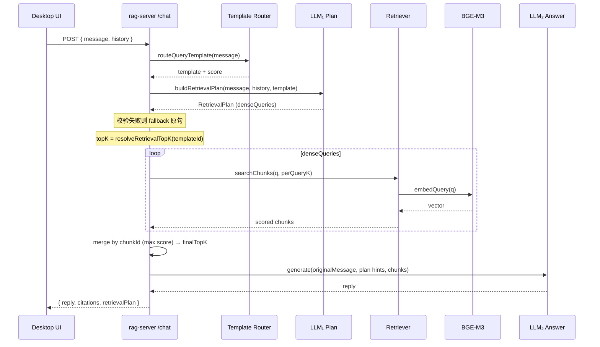

# reRAG：检索前结构化规划设计

> 状态：已实现 MVP（见 §11）  
> 相关代码：`apps/rag-server`（编排 / 检索 / Ollama）、`apps/desktop`（会话与 `/chat` 调用）  
> 日期：2026-07-28

---

## 1. 背景与动机

### 1.1 演进

早期问答链路为：

```
用户输入 → BGE-M3 向量检索（固定 topK）→ LLM 生成答案
```

现已演进为 **模板路由 + 结构化规划 + 多路检索 + 动态 topK**：

```
用户输入 + 会话历史
  → 意图模板路由（exemplar 相似度）
  → LLM₁ 按模板配方生成 RetrievalPlan（denseQueries）
  → 多路 dense 检索 → 合并 → 按 templateId 动态 topK
  → LLM₂ 生成答案（原问 + intent/answerHint + chunks）
```

### 1.2 问题

1. **语义相近 ≠ 任务相关**  
   例如「涉及多少人物」易命中「嫌疑人筛选方法论」段落，而非具名角色叙事。
2. **单向量查询无法表达多维度**  
   意图（列举 / 事实 / 对比）、专名、口语改写无法在一次 embed 中显式分离。
3. **无会话上下文**  
   「他后来呢」无法消解指代；规划侧需要 history。
4. **单纯「LLM 改写成另一句再检索」不够**  
   且仓库无查询语法引擎；输出假 SQL/Lucene 无执行面。
5. **固定 topK 不适配任务广度**  
   事实题 5 条够用；总结/时间线/列举需要更宽召回，否则答案残缺。

### 1.3 目标

用 **通用意图模板** 把「问法形状」与「检索/生成策略」绑定；规划 LLM 只填可执行字段；按模板控制召回深度。

**不追求**通用「查询语法」；计划字段必须与现有检索能力对齐。

---

## 2. 设计原则

| 原则 | 说明 |
|------|------|
| 每问必规划 | 不做「简单题跳过规划」分流（分类本身不可靠） |
| 结构可执行 | 只输出检索器能用的字段，不输出伪查询语言 |
| 回答用原问 | 检索用 plan；生成仍以用户当前问题为主，避免改写污染语义 |
| 规划用历史 | 会话历史优先服务指代消解与规划，首版不强制整段喂给生成 |
| keywords 观察先行 | 首版 keywords 只记录，不参与打分 |
| 失败可回退 | 规划失败时退化为「原句单路检索」，聊天不中断 |
| 可观测 | 规划与生成入参写入 `.data/logs/llm-queries.jsonl`，API 回传 plan |
| 通用意图模板 | BGE-M3 对 exemplar 问法做相似度路由；`answerHint`/`intent`/topK 由模板强制，不绑领域主题 |
| 召回深度随意图 | 精确题浅召回、综合题深召回；按 `templateId` 而非全局常数 |

---

## 2.1 通用意图模板路由（MVP）

检索规划前，用 BGE-M3（**无** retrieval prefix）将用户问句与各模板 **通用 exemplar** 做 cosine，按模板取 max 分选中模板。

| templateId | 用途 | intent | finalTopK | perQueryK |
|------------|------|--------|----------:|----------:|
| `inventory_sources` | 有哪些材料/章节/产品功能 | enumerate | 12 | 8 |
| `enumerate_entities` | 多少/哪些具名实体 | enumerate | 12 | 8 |
| `summarize_overview` | 总结/概览/时间线类综合 | summarize | 15 | 10 |
| `fact_lookup` | 单点事实 | fact | 5 | 5 |
| `locate_passage` | 定位出处 | locate | 5 | 5 |
| `explain_how` | 机制/原因 | explain | 8 | 6 |
| `compare_two` | 对比（可多于两侧） | compare | 10 | 6 |
| `generic_fallback` | embed 失败 / 未知 id（不入 exemplar 索引） | other | 8 | 6 |
| （无 plan / 未知） | 默认 topK | — | 8 | 6 |

- exemplar **禁止**写死当前知识库主题（如某书、某技术名）；主题只从当次用户输入抽取。
- `answerHint` / `intent` / `finalTopK` / `perQueryK` **始终**来自模板；规划 LLM 只填 `denseQueries` + `keywords`。
- 分低于 `PIFLOW_TEMPLATE_SCORE_MIN`（默认 0.42）时仍选最高分模板 id，但 hint/recipe 偏保守；plan 回传 `lowConfidence: true`。
- 「有哪些功能/能力/模块」优先 `inventory_sources`，勿与 `enumerate_entities`（具名人物/对象）混淆。
- 实现：`query-templates.ts`、`template-router.ts`；plan 回传 `templateId` / `templateScore` / `lowConfidence`。

---

## 2.2 分层查询构建（核心方法）

本系统不把「查询改写」做成单次 LLM 黑盒，而是用模板把检索拆成 **四级可控策略**。每一级职责不同、失败面独立。

```
┌─────────────────────────────────────────────────────────────┐
│ L1 意图形状（问法）                                           │
│    exemplar 相似度 → templateId / intent                    │
├─────────────────────────────────────────────────────────────┤
│ L2 模板策略（任务级）                                         │
│    queryRecipe · answerHint · finalTopK / perQueryK         │
├─────────────────────────────────────────────────────────────┤
│ L3 多路查询实例（本次问题）                                    │
│    规划 LLM → denseQueries[]（+ keywords 仅观测）             │
├─────────────────────────────────────────────────────────────┤
│ L4 检索执行与召回深度                                         │
│    每路 perQueryK → 合并去重 → 全局 finalTopK → 生成         │
└─────────────────────────────────────────────────────────────┘
```

### L1 — 意图形状路由（embedding，非 LLM）

| 项 | 说明 |
|----|------|
| 输入 | 用户当前问句 |
| 方法 | 问句 embed ↔ 各模板 exemplar embed，模板内取 max，全局取最高 |
| 输出 | `templateId`、`templateScore`、`lowConfidence`、matched exemplar |
| 为何不用 LLM 分类 | 稳定、快、可复现；exemplar 可随问法扩展而不改模型 |
| 代码 | `template-router.ts` → `routeQueryTemplate` |

要点：匹配的是 **问法形状**（「有哪些 / 哪一年 / 怎么运作」），不是知识库主题。主题词留给 L3 从原问抽取。

### L2 — 模板绑定的任务级策略（静态配置）

每个 `QueryTemplate` 同时规定三件事：

| 字段 | 作用层级 | 说明 |
|------|----------|------|
| `intent` | 生成约束标签 | 写入生成 prompt |
| `queryRecipe` | **约束规划 LLM** | 告诉 LLM₁ 该生成什么样的 denseQueries（条数倾向、侧面、忌讳） |
| `answerHint` | **约束生成 LLM** | 强制回答形态（列举须引用来源、事实禁止猜测等） |
| `finalTopK` / `perQueryK` | **约束召回深度** | 综合题宽、精确题窄 |

这是「不同级别查询方法」的配置面：换模板 = 换一整套检索+生成策略，而无需改编排逻辑。

代码：`query-templates.ts`（`QUERY_TEMPLATES` + `resolveRetrievalTopK`）。

**为何按 templateId 定 topK，而不是粗 intent：**  
`enumerate` 同时覆盖「盘点来源/功能」与「列实体」；`summarize` 对应概览。`templateId` 粒度更贴任务广度。

| 任务广度 | 模板 | 召回策略 |
|----------|------|----------|
| 精确（单点） | fact / locate | 浅：5 / 5，降噪 |
| 中等（机制/对比） | explain / compare | 中：8–10，覆盖两侧或步骤 |
| 宽（盘点/列举） | inventory / enumerate | 宽：12 / 8 |
| 最宽（概览/时间线） | summarize | 最宽：15 / 10 |

### L3 — 多路查询实例化（规划 LLM）

| 项 | 说明 |
|----|------|
| 输入 | 当前问 + 裁剪后 history + **已选定模板的 `queryRecipe`** |
| 输出 | `denseQueries`（1～5）+ `keywords`（观测） |
| 禁止输出 | `intent` / `answerHint` / 模板英文 id（会 scrub） |
| 失败回退 | `denseQueries: [原问]`，聊天不中断 |

**多路的含义：** 一条用户问题拆成多条可 embed 的检索句，表达不同侧面，例如：

- 列举人物 → 「具名角色清单」「姓名出现」「某某书中的人物」
- 对比两者 → 侧 A、侧 B、「区别/对比」
- 概览/时间线 → 导论、关键事件、结论/年表侧面

规划 LLM **不**自由发明检索策略；它只在模板配方给定的「级别」内填词。这比「整句改写」更可控，也比「单向量硬搜」更能覆盖多维证据。

代码：`query-plan.ts` → `buildRetrievalPlan` / `buildPlanPrompt`。

### L4 — 检索执行与动态召回

```
for q in denseQueries:
    hits += searchChunks(q, perQueryK)   # BGE-M3 + QUERY_PREFIX
merge by chunkId (keep max score)
sort → slice(0, finalTopK)
→ citations + 生成上下文
```

| 参数 | 含义 |
|------|------|
| `perQueryK` | 每一路 dense 查询先取多少；过小则多路几乎无增益 |
| `finalTopK` | 合并后留给 LLM₂ 的条数；决定上下文预算与答案完整度 |

编排：`orchestrator.ask` 调用 `resolveRetrievalTopK(plan.templateId)` 后再 `searchWithQueries`。  
实现：`retriever.ts` → `searchWithQueries`。

### 层级如何协作（一例）

用户问：「整理中本聪的本体活动时间线」

1. **L1** 问法接近概览/综合 → 常路由至 `summarize_overview`（或 enumerate 类）
2. **L2** 模板给出宽召回（如 15/10）+ 概览类 `queryRecipe` / `answerHint`
3. **L3** 规划 LLM 产出多条含「中本聪」及时期/事件侧面的 `denseQueries`
4. **L4** 多路召回合并后保留更多 chunk，LLM₂ 才有材料排时间线

若同一知识库改问「中本聪白皮书是哪一年发布的」：

1. **L1** → `fact_lookup`
2. **L2** → topK=5，事实类 hint（不知则说不知）
3. **L3** → 1～3 条短查询，紧扣年份槽
4. **L4** → 浅召回，减少噪声段落干扰

**同一套流水线，不同模板 = 不同级别的查询方法。**

### 实现映射

| 层级 | 模块 | 关键符号 |
|------|------|----------|
| L1 | `services/retrieval/template-router.ts` | `routeQueryTemplate` |
| L2 | `services/retrieval/query-templates.ts` | `QUERY_TEMPLATES`, `resolveRetrievalTopK` |
| L3 | `services/retrieval/query-plan.ts` | `buildRetrievalPlan` |
| L4 | `services/retrieval/retriever.ts` + `chat/orchestrator.ts` | `searchWithQueries`, `ask` |
| 生成约束 | `services/generation/*` | prompt 注入 `intent` + `answerHint` |

### 设计取舍（已确认）

| 取舍 | 选择 | 原因 |
|------|------|------|
| 分类用 embed exemplar | 是 | 快、稳；主题不进模板 |
| 规划 LLM 可否改 intent/hint | 否 | 防漂移；策略锁在模板 |
| topK 全局常数 | 否 | 综合题残缺、事实题过噪 |
| keywords 参与打分 | 暂否（方案 A） | 先观测再开方案 B |
| 生成是否吃完整 history | 首版否 | 控上下文；指代已在 L3 消解进 queries |

---

## 3. 端到端流程



---

## 4. RetrievalPlan 契约

### 4.1 TypeScript 形状

```ts
export type RetrievalIntent =
  | 'fact'       // 单点事实（哪年、是谁、定义）
  | 'enumerate'  // 列举 / 多少 / 有哪些
  | 'explain'    // 解释过程、原因
  | 'compare'    // 对比
  | 'locate'     // 找原文、出处
  | 'summarize'  // 总结 / 概览
  | 'other';

export interface RetrievalPlan {
  intent: RetrievalIntent;
  /** 1～5 条，供 embedQuery；短、偏文档表述，保留专名；常用 2～4，列举/对比可到 5 */
  denseQueries: string[];
  /** 专名/术语；首版仅日志与 API 回传，不参与打分 */
  keywords: string[];
  /** 给生成侧的短约束（由通用意图模板强制） */
  answerHint: string;
  templateId?: string;
  templateScore?: number;
  /** 路由分低于阈值时 true（保守 hint/recipe） */
  lowConfidence?: boolean;
}

export interface ChatResult {
  reply: string;
  citations: Citation[];
  retrievalPlan: RetrievalPlan;
}
```

### 4.2 字段职责

| 字段 | 用途 | 首版执行 |
|------|------|----------|
| `intent` | 任务类型 | 写入生成 prompt 约束 |
| `denseQueries` | 多路向量查询 | 各路检索后合并；最终 topK 按 `templateId` 动态（见 §2.1 / §2.2） |
| `keywords` | 实体敏感词 | **只记日志 / 回传 plan（方案 A）**，不加分 |
| `answerHint` | 生成约束文案 | 拼进生成 prompt 头部 |
| `templateId` | 选中的意图模板 | 决定 recipe / hint / topK；回传便于调试 |
| `lowConfidence` | 路由低置信度 | 观测保守 hint 占比；仍用 bestId 的 topK |

### 4.3 刻意不做（MVP）

- 布尔/Lucene/SQL 查询语法
- `avoid_topics` 负向检索
- keywords 命中 title/content 加分（后续可开方案 B）
- 「简单题跳过 LLM 规划」
- 检索不足再二次规划（adaptive）——可作 v2

---

## 5. 会话历史（多轮指代）

### 5.1 API

```ts
// POST /chat
{
  message: string;
  history?: Array<{
    role: 'user' | 'assistant';
    content: string;
  }>;
}
```

- `message`：当前用户输入
- `history`：当前句**之前**的轮次（不要把当前 `message` 再塞进 history）
- 前端从当前 `ChatSession.messages` 截取后传入

### 5.2 窗口（默认）

- 最近 **6 条** message，或合计内容 **≤ 2000 字**（先到为准）
- 只传 `role` + `content`；citations 不传给规划

### 5.3 使用范围

| 阶段 | 是否使用 history |
|------|------------------|
| LLM₁ 规划 | **是**（指代消解、补全实体） |
| 向量检索 | 否（只用 plan.denseQueries） |
| LLM₂ 生成 | **首版否**（当前问 + answerHint + chunks）；避免上下文膨胀 |

### 5.4 示例

```
history:
  user: 中本聪是谁？
  assistant: ……
message: 他后来去哪了？

→ denseQueries 应含「中本聪」等消解后实体，而非仅「他」
```

---

## 6. 规划 LLM（LLM₁）

### 6.1 后端

与生成相同：优先已配置的 Ollama（`PIFLOW_OLLAMA_URL`）。

### 6.2 输出要求

- 仅 JSON，不回答用户问题
- 只填 `denseQueries` + `keywords`；`intent` / `answerHint` 由模板强制覆盖
- `denseQueries`：1～5 条（常用 2～4；列举/对比可到 5）；去寒暄；专名保留；可中英搭配；勿同义凑数
- 遵守模板 `queryRecipe`（条数倾向、侧面、忌讳）
- `temperature=0`，短 `num_predict`，**独立短超时**（`PIFLOW_PLAN_TIMEOUT_MS`，默认 30s）

### 6.3 Fallback

任一步失败（无后端 / 超时 / JSON 无效 / 空 queries）：

- 仍尽量保留已路由的模板 meta（若路由成功）
- `denseQueries` 退化为 `[message]`
- 行为接近单路检索，但 topK 仍可按 `templateId` 解析

### 6.4 日志

- `stage: 'retrieval-plan'`
- 记录：完整规划 prompt、解析后的 plan、所用 model/endpoint
- 流水线 timing：`.data/logs/pipeline-timing.jsonl`（含 `templateId`、`finalTopK`、`chunkCount`）
- 生成日志：`stage: 'generation'`

路径：`.data/logs/llm-queries.jsonl`（已 gitignore）。

---

## 7. 检索执行

1. `resolveRetrievalTopK(plan.templateId)` 得到 `finalTopK` / `perQueryK`。
2. 对 `denseQueries` 每一条调用 `searchChunks(q, perQueryK)`（BGE-M3 `QUERY_PREFIX` + cosine）。
3. 按 `chunkId` 去重，保留最高分。
4. 全局排序，取 **`finalTopK`** 进入生成与 citations。
5. **不**用 keywords 改分（方案 A）。

后续可选：RRF 合并、keywords 小幅加分（方案 B）、BM25 混合、MMR 多样性。

---

## 8. 生成 LLM（LLM₂）

- 仍使用用户 **当前 `message`** 作为「问题」。
- 在 RAG instruct / Pleias prompt 头部增加：
  - `intent`
  - `answerHint`（若非空）
- 资料区为 **动态 topK** 条 chunks；引用规则不变。
- 生成失败时的检索摘要 fallback 逻辑保持不变。

---

## 9. 前端与类型

| 位置 | 变更 |
|------|------|
| `packages/core` | 增加 `RetrievalIntent`、`RetrievalPlan`；`ChatResult` 含 `retrievalPlan` |
| `apps/rag-server` `routes/chat` | 接收 `history`；返回 `retrievalPlan` |
| `apps/desktop` `api/rag.ts` | `sendChatMessage(message, history?)` |
| `apps/desktop` `App.tsx` | 发送前从 session 截取 history；可选暂不展示 plan（先回传便于调试） |

UI 是否展示 plan：MVP 可不展示，但类型与网络层必须带回，便于调试面板后续接入。

---

## 10. 与「旧/新答案对比」的关系

评估应以 `llm-queries.jsonl` 中的 `retrievalPlan` + `retrieved`，以及 `pipeline-timing.jsonl` 中的 `templateId` / `finalTopK` / `chunkCount` 对照。  
同一批问题回归时，关注：事实题是否仍简洁、列举/时间线是否因更大 topK 明显更完整。

---

## 11. 实现任务清单

- [x] `packages/core`：Plan / ChatResult 类型
- [x] `services/retrieval/query-plan.ts`：prompt、调用、解析、fallback
- [x] `services/retrieval/query-templates.ts` + `template-router.ts`：通用意图模板与路由
- [x] `retriever`：`searchWithQueries` 合并；topK 由模板 `finalTopK`/`perQueryK` 决定
- [x] `orchestrator.ask(message, history?)` 串起路由→规划→检索→生成
- [x] 生成 prompt 注入 `intent` + `answerHint`
- [x] `POST /chat` 支持 `history`，响应带 `retrievalPlan`
- [x] Desktop 传 history
- [x] 规划阶段写入 llm 日志；timing 记录 topK
- [ ] 手工回归：单轮事实题、列举题、多轮指代题（「他」）、时间线/概览题

---

## 12. 后续演进（非 MVP）

1. keywords 命中加分（方案 B）
2. RRF / BM25 hybrid
3. 检索质量不够再二次规划（adaptive）
4. history 有限注入生成（摘要后）
5. UI 展示 retrievalPlan 与检索词，便于用户理解与反馈
6. 可选 `timeline_rebuild` 模板（exemplar：时间线/年表/活动历程），与 summarize 分离

---

## 13. 已确认决策一览

| 决策点 | 选择 |
|--------|------|
| 每问是否规划 | 是；先通用意图模板路由，再窄规划 LLM |
| keywords | A：仅日志/回传，不打分 |
| 最终 topK | 按 `templateId` 动态（fact/locate=5；explain=8；compare=10；enumerate=12；summarize=15；未知=8） |
| API 回传 plan | 是（`retrievalPlan`，含 `templateId`/`templateScore`） |
| intent 集合 | 7 个粗标签（含 summarize）+ 7 个可路由模板 id + `generic_fallback` |
| 会话历史 | 需要；规划使用；窗口默认 6 条 / ≤2000 字 |
| 生成是否用 history | 首版否 |
| 查询语法 DSL | 不做；用 RetrievalPlan JSON |
| answerHint | 由模板强制，不依赖规划 LLM 填写 |
| 分层查询 | L1 路由 → L2 模板策略 → L3 多路实例化 → L4 动态召回（见 §2.2） |
| lowConfidence | plan/timing 回传；低分时保留 bestId，换保守 hint/recipe |

---

*文档版本：v0.3 · 模板裁决与 inventory/enumerate 分流 2026-07-29*
