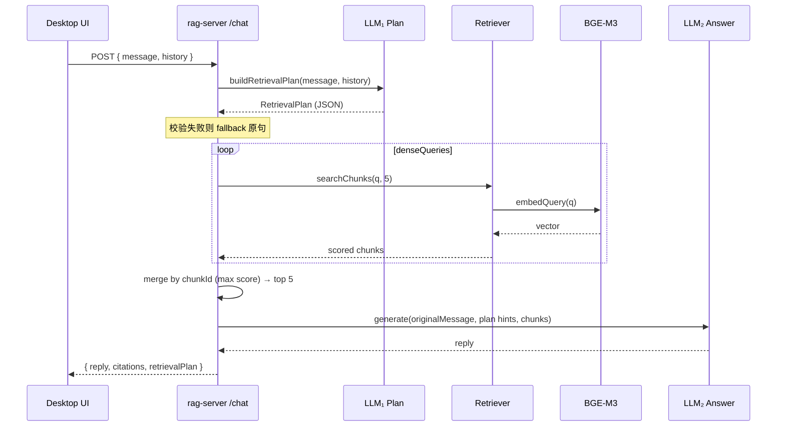

# reRAG：检索前结构化规划设计

> 状态：已实现 MVP（见 §11）  
> 相关代码：`apps/rag-server`（编排 / 检索 / Ollama）、`apps/desktop`（会话与 `/chat` 调用）  
> 日期：2026-07-28

---

## 1. 背景与动机

### 1.1 现状

当前问答链路为：

```
用户输入 → BGE-M3 向量检索 → LLM 生成答案
```

实现见 `orchestrator.ask`：用户原句直接 `searchChunks`，再生成。

### 1.2 问题

1. **语义相近 ≠ 任务相关**  
   例如「涉及多少人物」易命中「嫌疑人筛选方法论」段落，而非具名角色叙事。
2. **单向量查询无法表达多维度**  
   意图（列举 / 事实 / 对比）、专名、口语改写无法在一次 embed 中显式分离。
3. **无会话上下文**  
   前端已有多轮 `messages`，但 `POST /chat` 只传当前句；「他后来呢」无法消解指代。
4. **单纯「LLM 改写成另一句再检索」不够**  
   且仓库尚无查询语法引擎；输出假 SQL/Lucene 无执行面。

### 1.3 目标

在每次检索前，用 LLM 生成**可执行的结构化检索计划（RetrievalPlan）**，再检索、再生成：

```
用户输入 + 会话历史
  → LLM₁ 生成 RetrievalPlan
  → 多路 dense 检索（合并）→ topK=5
  → LLM₂ 生成答案（原问 + intent 约束 + chunks）
```

**不追求**通用「查询语法」；计划字段必须与现有检索能力对齐。

---

## 2. 设计原则

| 原则 | 说明 |
|------|------|
| 每问必规划 | 不做「简单题跳过规划」分流（分类本身不可靠） |
| 结构可执行 | 只输出检索器能用的字段，不输出伪查询语言 |
| 回答用原问 | 检索用 plan；生成仍以用户当前问题为主，避免改写污染语义 |
| 规划用历史 | 会话历史优先服务指代消解与规划，首版不强制整段喂给生成 |
| keywords 观察先行 | 首版 keywords 只记录，不参与打分 |
| 失败可回退 | 规划失败时退化为「原句单路检索」，聊天不中断 |
| 可观测 | 规划与生成入参写入 `.data/logs/llm-queries.jsonl`，API 回传 plan |
| 通用意图模板 | BGE-M3 对 exemplar 问法做相似度路由；`answerHint`/`intent` 由模板强制，不绑领域主题 |

---

## 2.1 通用意图模板路由（MVP）

检索规划前，用 BGE-M3（无 retrieval prefix）将用户问句与各模板 **通用 exemplar** 做 cosine，按模板取 max 分选中模板。

| templateId | 用途 | intent |
|------------|------|--------|
| `inventory_sources` | 有哪些材料/章节讲了某主题 | enumerate |
| `enumerate_entities` | 多少/哪些具名实体 | enumerate |
| `summarize_overview` | 总结/概览 | other |
| `fact_lookup` | 单点事实 | fact |
| `locate_passage` | 定位出处 | locate |
| `explain_how` | 机制/原因 | explain |
| `compare_two` | 对比 | compare |

- exemplar **禁止**写死当前知识库主题（如某书、某技术名）；主题只从当次用户输入抽取。
- `answerHint` **始终**来自模板；规划 LLM 只填 `denseQueries` + `keywords`。
- 分低于 `BLUELAMP_TEMPLATE_SCORE_MIN`（默认 0.42）时仍选最高分模板，但 hint/recipe 偏保守。
- 实现：`query-templates.ts`、`template-router.ts`；plan 回传 `templateId` / `templateScore`。

---

## 3. 端到端流程



---

## 4. RetrievalPlan 契约

### 4.1 TypeScript 形状

```ts
export type RetrievalIntent =
  | 'fact'       // 单点事实（哪年、是谁、定义）
  | 'enumerate'  // 列举 / 多少 / 有哪些
  | 'explain'    // 解释过程、原因
  | 'compare'    // 对比
  | 'locate'     // 找原文、出处
  | 'other';

export interface RetrievalPlan {
  intent: RetrievalIntent;
  /** 1～5 条，供 embedQuery；短、偏文档表述，保留专名；常用 2～4，列举/对比可到 5 */
  denseQueries: string[];
  /** 专名/术语；首版仅日志与 API 回传，不参与打分 */
  keywords: string[];
  /** 给生成侧的短约束（由通用意图模板强制） */
  answerHint: string;
  templateId?: string;
  templateScore?: number;
}

export interface ChatResult {
  reply: string;
  citations: Citation[];
  retrievalPlan: RetrievalPlan;
}
```

### 4.2 字段职责

| 字段 | 用途 | 首版执行 |
|------|------|----------|
| `intent` | 任务类型 | 写入生成 prompt 约束 |
| `denseQueries` | 多路向量查询 | 各路检索后合并，最终 topK=**5** |
| `keywords` | 实体敏感词 | **只记日志 / 回传 plan（方案 A）**，不加分 |
| `answerHint` | 生成约束文案 | 拼进生成 prompt 头部 |

### 4.3 刻意不做（MVP）

- 布尔/Lucene/SQL 查询语法
- `avoid_topics` 负向检索
- keywords 命中 title/content 加分（后续可开方案 B）
- 「简单题跳过 LLM 规划」
- 检索不足再二次规划（adaptive）——可作 v2

---

## 5. 会话历史（多轮指代）

### 5.1 API

```ts
// POST /chat
{
  message: string;
  history?: Array<{
    role: 'user' | 'assistant';
    content: string;
  }>;
}
```

- `message`：当前用户输入
- `history`：当前句**之前**的轮次（不要把当前 `message` 再塞进 history）
- 前端从当前 `ChatSession.messages` 截取后传入

### 5.2 窗口（默认）

- 最近 **6 条** message，或合计内容 **≤ 2000 字**（先到为准）
- 只传 `role` + `content`；citations 不传给规划

### 5.3 使用范围

| 阶段 | 是否使用 history |
|------|------------------|
| LLM₁ 规划 | **是**（指代消解、补全实体） |
| 向量检索 | 否（只用 plan.denseQueries） |
| LLM₂ 生成 | **首版否**（当前问 + answerHint + chunks）；避免上下文膨胀 |

### 5.4 示例

```
history:
  user: 中本聪是谁？
  assistant: ……
message: 他后来去哪了？

→ denseQueries 应含「中本聪」等消解后实体，而非仅「他」
```

---

## 6. 规划 LLM（LLM₁）

### 6.1 后端

与生成相同：优先已配置的 Ollama（`BLUELAMP_OLLAMA_URL`，当前 `http://10.0.0.7:11434`）。

### 6.2 输出要求

- 仅 JSON，不回答用户问题
- `denseQueries`：1～5 条（常用 2～4；列举/对比可到 5）；去寒暄；专名保留；可中英搭配；勿同义凑数
- `intent=enumerate` 时：至少一条偏「姓名/人物/角色」，避免只生成「筛选流程」类查询
- `temperature=0`，短 `num_predict`，**独立短超时**（建议 15–30s，与生成超时分离）

### 6.3 Fallback

任一步失败（无后端 / 超时 / JSON 无效 / 空 queries）：

```ts
{
  intent: 'other',
  denseQueries: [message],
  keywords: [],
  answerHint: '',
}
```

行为退化为今日单路检索。

### 6.4 日志

- `stage: 'query-rewrite'`（或更名 `retrieval-plan`）
- 记录：完整规划 prompt、解析后的 plan、所用 model/endpoint
- 现有生成日志继续保留（`stage: 'generation'`）

路径：`.data/logs/llm-queries.jsonl`（已 gitignore）。

---

## 7. 检索执行

1. 对 `denseQueries` 每一条调用现有 `searchChunks(q, 5)`（内部仍走 BGE-M3 `QUERY_PREFIX` + cosine）。
2. 按 `chunkId` 去重，保留最高分。
3. 全局排序，取 **top 5** 进入生成与 citations。
4. **不**用 keywords 改分（方案 A）。

后续可选：RRF 合并、keywords 小幅加分（方案 B）、BM25 混合。

---

## 8. 生成 LLM（LLM₂）

- 仍使用用户 **当前 `message`** 作为「问题」。
- 在 RAG instruct / Pleias prompt 头部增加：
  - `intent`
  - `answerHint`（若非空）
- 资料区为 top5 chunks；引用规则不变。
- 生成失败时的检索摘要 fallback 逻辑保持不变。

---

## 9. 前端与类型

| 位置 | 变更 |
|------|------|
| `packages/core` | 增加 `RetrievalIntent`、`RetrievalPlan`；`ChatResult` 含 `retrievalPlan` |
| `apps/rag-server` `routes/chat` | 接收 `history`；返回 `retrievalPlan` |
| `apps/desktop` `api/rag.ts` | `sendChatMessage(message, history?)` |
| `apps/desktop` `App.tsx` | 发送前从 session 截取 history；可选暂不展示 plan（先回传便于调试） |

UI 是否展示 plan：MVP 可不展示，但类型与网络层必须带回，便于调试面板后续接入。

---

## 10. 与「旧/新答案对比」的关系

此前中本聪人物列举的旧/新差异，**不能**归因于本设计——当时改写链路尚未实现，差异来自问法与生成抽样。  
本设计落地后，应以 `llm-queries.jsonl` 中的 `retrievalPlan` + `retrieved` 对照评估，再用同一批问题回归。

---

## 11. 实现任务清单

- [x] `packages/core`：Plan / ChatResult 类型
- [x] `services/retrieval/query-plan.ts`：prompt、调用、解析、fallback
- [x] `retriever`：`searchWithQueries` 合并 top5
- [x] `orchestrator.ask(message, history?)` 串起规划→检索→生成
- [x] 生成 prompt 注入 `intent` + `answerHint`
- [x] `POST /chat` 支持 `history`，响应带 `retrievalPlan`
- [x] Desktop 传 history
- [x] 规划阶段写入 llm 日志
- [ ] 手工回归：单轮事实题、列举题、多轮指代题（「他」）

---

## 12. 后续演进（非 MVP）

1. keywords 命中加分（方案 B）
2. RRF / BM25 hybrid
3. 检索质量不够再二次规划（adaptive）
4. history 有限注入生成（摘要后）
5. UI 展示 retrievalPlan 与检索词，便于用户理解与反馈

---

## 13. 已确认决策一览

| 决策点 | 选择 |
|--------|------|
| 每问是否规划 | 是；先通用意图模板路由，再窄规划 LLM |
| keywords | A：仅日志/回传，不打分 |
| 最终 topK | 5 |
| API 回传 plan | 是（`retrievalPlan`，含 `templateId`/`templateScore`） |
| intent 集合 | 6 个粗标签 + 7 个通用模板 id |
| 会话历史 | 需要；规划使用；窗口默认 6 条 / ≤2000 字 |
| 生成是否用 history | 首版否 |
| 查询语法 DSL | 不做；用 RetrievalPlan JSON |
| answerHint | 由模板强制，不依赖规划 LLM 填写 |

---

*文档版本：v0.1 · 对应讨论结论 2026-07-28*
